# Solution Overview and Executive Summary: SatQuery AI

## 1. DOCUMENT CONTROL

| Attribute | Details |
| :--- | :--- |
| **Document ID** | SQ-DOC-001 |
| **Document Name** | Solution Overview and Executive Summary |
| **Project Name** | SatQuery AI (PS ID 26167) |
| **Organization** | Indian Space Research Organisation (ISRO), Department of Space |
| **Version** | 1.0.0 |
| **Date** | 2026-09-09 |
| **Authors** | [Authors Placeholder] |
| **Status** | Final |
| **Classification** | Public / Hackathon Submission |

### Revision History

| Version | Date | Author | Description of Changes |
| :--- | :--- | :--- | :--- |
| 0.1.0 | 2026-09-01 | Team Lead | Initial Draft and outlining |
| 0.5.0 | 2026-09-05 | Technical Writer | Expanded Architecture and Traceability sections |
| 0.9.0 | 2026-09-07 | ML Architect | Model Registry and Metric Refinements |
| 1.0.0 | 2026-09-09 | System Engineer | Final review and formatting for SIH Submission |

---

## 2. EXECUTIVE SUMMARY

The rapid proliferation of Earth Observation (EO) satellites has resulted in an unprecedented volume of multispectral and Synthetic Aperture Radar (SAR) data. While this data holds immense potential for monitoring planetary health, disaster response, and urban planning, its utility is significantly bottlenecked by the specialized expertise required to analyze it. Traditional Geographic Information Systems (GIS) and remote sensing software demand a steep learning curve, effectively barring non-expert stakeholders from directly querying or deriving insights from satellite imagery.

**SatQuery AI** is an interactive vision-language assistant designed to democratize remote sensing image analysis. Addressing the Smart India Hackathon problem statement PS ID 26167, the system acts as an intelligent intermediary between complex multimodal EO data and natural language text queries. By leveraging an agentic orchestration layer powered by LangGraph, SatQuery AI dynamically routes user queries to a registry of specialized machine learning models and deterministic tools. This orchestration enables complex, multi-step reasoning—such as analyzing bi-temporal change detection, calculating spectral indices, and performing visual grounding—all triggered by conversational prompts.

The architecture fundamentally departs from monolithic Vision-Language Models (VLMs) by embracing a modular approach. This not only enhances performance on specialized tasks (e.g., optical-SAR cross-modal reasoning) but also guarantees auditable execution traces. Every conclusion generated by SatQuery AI is backed by visual evidence, confidence scores, and a clear lineage of the tools invoked. By abstracting away the complexities of geospatial data processing, SatQuery AI empowers a diverse range of users, from ISRO scientists to civil administrators, to rapidly extract critical insights and drive evidence-based decision-making.

---

## 3. PROBLEM ANALYSIS

### 3.1 Problem Context

The domain of remote sensing has witnessed a paradigm shift from data scarcity to data abundance. Constellations of satellites now provide continuous global coverage across various electromagnetic spectrums (optical, near-infrared, thermal) and active sensing modalities like Synthetic Aperture Radar (SAR). Organizations like ISRO generate petabytes of data aimed at serving national interests.

However, extracting actionable intelligence from this data remains a manual, time-consuming process restricted to trained geospatial analysts. The standard workflow involves downloading massive multi-band GeoTIFF files, loading them into specialized software (e.g., QGIS, ArcGIS), applying band combinations or arithmetic operations to calculate indices, and visually inspecting the results. When temporal analysis is required (e.g., identifying deforested areas over a year), the complexity compounds due to the necessity of precise spatial co-registration and radiometric normalization.

The current limitation lies in the interface: humans must speak the language of pixels, projections, and band ratios to interact with the data. There is a pressing need for a system that allows users to query satellite data using natural language, effectively shifting the cognitive load of data manipulation from the human analyst to an intelligent computational framework.

### 3.2 Stakeholder Pain Points

The absence of an intuitive interface for satellite data creates distinct pain points across various user demographics:

*   **Non-Expert Decision Makers (Civil Administrators, Urban Planners):** These users require rapid answers to specific questions (e.g., "How many new structures were built near the river this year?"). They lack the software and training to perform the analysis themselves, forcing them to rely on back-and-forth communications with GIS departments, introducing critical delays.
*   **First Responders and Disaster Management Teams:** In crisis scenarios like floods or earthquakes, time is of the essence. First responders need immediate delineation of affected areas (e.g., "Highlight flooded roads"). Traditional analysis pipelines are too slow for real-time operational support.
*   **ISRO Scientists and GIS Analysts:** While these users possess the necessary expertise, their time is misallocated to repetitive, routine tasks (e.g., calculating NDVI, formatting reports, filtering noisy SAR images). They require an assistant that automates lower-level processing, freeing them for high-level interpretation and strategic research.
*   **Agricultural Extension Workers:** Monitoring crop health or drought conditions requires calculating specific spectral indices across large temporal datasets. The lack of an automated, query-based system limits their ability to monitor vast agricultural zones effectively.

### 3.3 Gap Analysis

A critical review of existing remote sensing tools and state-of-the-art vision-language models reveals several significant gaps:

1.  **Isolated Single-Task Systems:** Existing ML models for remote sensing are typically narrow in scope. A model trained for change detection cannot perform visual question answering (VQA); a model trained for land-cover classification cannot generate natural language captions. Users must string together these disparate tools manually.
2.  **Lack of Agentic Orchestration:** Current systems process inputs through a static pipeline. They lack the intelligence to dynamically decompose a complex query (e.g., "Find flooded areas and tell me their total area in square kilometers") into a logical sequence of sub-tasks, select the appropriate tools, and synthesize the outputs.
3.  **Inadequate Cross-Modal Reasoning (Optical + SAR):** Optical sensors are hindered by cloud cover, making them unreliable during monsoons or specific weather events. SAR sensors penetrate clouds but are difficult to interpret due to speckle noise. Existing tools rarely fuse these modalities seamlessly. A critical gap is the inability to reason jointly over co-registered optical and SAR imagery.
4.  **Poor UX for Non-GIS Users:** Existing platforms often assume baseline knowledge of Coordinate Reference Systems (CRS), band numbers, and pixel resolutions. They do not accept natural language as a primary input modality, isolating the vast majority of potential users.
5.  **Opaque Black-Box Models:** Monolithic VLMs fine-tuned on remote sensing data often suffer from hallucination and lack interpretability. If a model asserts that a region is deforested, it rarely provides the execution trace or intermediate confidence scores to justify that assertion.

---

## 4. PROPOSED SOLUTION

### 4.1 Solution Philosophy

The foundational philosophy of SatQuery AI is to bridge the semantic gap between high-level human intent and low-level geospatial operations. We adhere to the following principles:

*   **Agentic Orchestration over Monolithic Inference:** Instead of training a single, massive VLM to perform every possible task—which often degrades performance and interpretability—we employ an intelligent orchestration layer. This agent dynamically routes queries to a registry of highly specialized, narrow-scope models and deterministic tools.
*   **Query-Driven Interaction:** The system uses natural language as the universal interface. Users describe what they want to know, and the system translates this into the necessary programmatic actions.
*   **Evidence-Grounded Responses:** Every textual claim made by the assistant must be supported by visual or statistical evidence. Bounding boxes, segmentation masks, change maps, and execution traces are first-class citizens in the response payload.
*   **Graceful Degradation:** The system must handle imperfect inputs robustly. If a user uploads a single image but asks a change detection question, the system must recognize the impossibility and prompt for the second image, rather than hallucinating an answer.
*   **Native Geospatial Fidelity:** The system must operate directly on scientific formats (e.g., multi-band GeoTIFFs), preserving spatial metadata, CRS information, and full dynamic range, rather than degrading data to 8-bit RGB before processing.

### 4.2 High-Level Architecture Overview

SatQuery AI is architected as a modular monolith, balancing deployment simplicity with logical separation of concerns. The architecture consists of a frontend interface, an API gateway, an intelligent agentic orchestration layer, an asynchronous task queue, and a distributed registry of machine learning models and geospatial tools.

```mermaid
flowchart TD
    User([User]) --> |Text Query + Images| UI(Frontend UI - Next.js)
    UI --> |REST API| API(FastAPI Backend)
    
    subgraph Core Orchestration
        API --> Validator(Input Validator & Metadata Extractor)
        Validator --> Planner(Agentic Planner - LangGraph)
        Planner --> |Query Intent| Classifier(Intent Classifier LLM)
        Classifier --> Planner
    end
    
    subgraph Task Execution
        Planner --> |Task Sub-graph| Queue(Celery Task Queue)
        Queue --> |Job Dispatch| Workers(GPU Inference Workers)
        
        Workers --> ModelReg[(Model & Tool Registry)]
        
        ModelReg --> RSVQA[RS-VQA Model]
        ModelReg --> Grounding[Visual Grounding Model]
        ModelReg --> CDModel[Change Detection Model]
        ModelReg --> Fusion[Optical-SAR Fusion]
        ModelReg --> Indices[Spectral Index Calculator]
    end
    
    Workers --> |Structured Output| Synthesizer(Output Synthesizer)
    Synthesizer --> |Composite JSON| API
    API --> UI
    
    %% Storage
    API -.- DB[(PostgreSQL + PostGIS)]
    API -.- ObjectStore[(MinIO Object Storage)]
```

### 4.3 Core Capabilities

SatQuery AI is equipped with a comprehensive suite of capabilities, directly mapped to the mandatory requirements of PS ID 26167:

1.  **Visual Question Answering (RS-VQA):** 
    *   **Description:** The system can answer open-ended questions about the contents of a remote sensing image.
    *   **Example Query:** "Are there any airports visible in this image?"
    *   **Underlying Mechanism:** Utilizes the GeoChat 7B model fine-tuned on the RSVQA and BigEarthNet datasets to interpret the image content and generate accurate textual responses.
2.  **Image Captioning:**
    *   **Description:** Generates comprehensive natural language descriptions of the scene depicted in the image.
    *   **Example Query:** "Provide a detailed description of the landscape in this area."
    *   **Underlying Mechanism:** Leverages the captioning prompt template with the VLM backbone to summarize land cover, built environment, and significant geographical features.
3.  **Visual Grounding and Localization:**
    *   **Description:** Translates textual descriptions into precise spatial coordinates, returning bounding boxes or segmentation masks.
    *   **Example Query:** "Highlight all the storage tanks in the port area."
    *   **Underlying Mechanism:** Integrates Grounding-DINO (for object detection from text) and SAM (Segment Anything Model) adapted for overhead imagery to generate pixel-perfect masks.
4.  **Bi-Temporal Change Detection and Analysis:**
    *   **Description:** Analyzes two co-registered images of the same location taken at different times to identify, delineate, and describe changes.
    *   **Example Query:** "What changes have occurred in the forest cover between 2023 and 2024?"
    *   **Underlying Mechanism:** Employs ChangeFormer or BiT (Binary change detection with Transformer) to generate pixel-level change maps. A secondary Change VQA model is used to answer specific questions regarding the identified changes.
5.  **Cross-Modal Analysis (Optical + SAR):**
    *   **Description:** Fuses information from disparate sensor types to overcome the limitations of individual modalities (e.g., optical cloud cover).
    *   **Example Query:** "Using both the optical and SAR images, delineate the true extent of the flooded region."
    *   **Underlying Mechanism:** Utilizes a custom dual-encoder with cross-attention fusion. It independently encodes optical and SAR features, fuses them, and utilizes the combined representation for robust classification or segmentation.
6.  **Deterministic Spectral Analysis:**
    *   **Description:** Performs precise, programmatic calculations of spectral indices (NDVI, NDWI, NDBI) on multi-band inputs.
    *   **Example Query:** "Calculate the NDVI for this region and highlight areas with high vegetation health."
    *   **Underlying Mechanism:** Bypasses ML models for these deterministic tasks, instead using the Spectral Index Calculator tool (powered by rasterio/numpy) to compute indices mathematically, ensuring scientific accuracy.

### 4.4 Key Differentiators

SatQuery AI distinguishes itself from existing literature and commercial platforms through several key innovations:

*   **Agentic Pipeline over Monolithic Design:** By treating complex VQA or analysis tasks as a directed acyclic graph (DAG) of sub-tasks, the system ensures higher accuracy. A monolithic model might hallucinate an NDVI value; our agent routes the request to a deterministic mathematical tool and incorporates the output into the final response.
*   **Explainable and Auditable Traces:** Every response includes an "Execution Trace" detailing exactly which models were invoked, the parameters used, and the confidence scores for each step. This transparency is crucial for adoption in governmental and scientific contexts.
*   **Native Multi-Band Handling:** The system does not silently convert scientific data into lossy 3-channel RGB images before processing. The Input Validator extracts metadata, and models are specifically adapted to handle up to 13 bands (e.g., Sentinel-2) and varied bit depths.
*   **SAR-Aware Preprocessing:** Recognizing the unique challenges of SAR data, the system automatically applies necessary preprocessing steps (speckle filtering, radiometric calibration, decibel conversion) before feeding the data into vision models, significantly improving performance on active sensing data.

---

## 5. SOLUTION-TO-REQUIREMENT TRACEABILITY MATRIX

The following table explicitly maps the requirements outlined in the PS ID 26167 to the corresponding components within the SatQuery AI architecture.

| Requirement ID | Problem Statement Requirement Description | SatQuery AI Component / Implementation | Verification Method |
| :--- | :--- | :--- | :--- |
| **REQ-01** | Support natural language queries for image analysis. | Next.js Frontend UI; FastAPI API Gateway; Intent Classifier LLM. | User testing; API load testing. |
| **REQ-02** | Implement Visual Question Answering (VQA) on single images. | Model Registry: RS-VQA Model (GeoChat 7B / QLoRA). | Benchmark evaluation on RSVQA dataset. |
| **REQ-03** | Provide Image Captioning capabilities. | Model Registry: RS-Captioning Model. | Qualitative review; METEOR/BLEU score on VRSBench. |
| **REQ-04** | Perform Visual Grounding (text to bounding box/mask). | Model Registry: Visual Grounding Model (Grounding-DINO + SAM). | IoU (Intersection over Union) metrics on VRSBench bounding boxes. |
| **REQ-05** | Support Bi-Temporal Change Detection and Change VQA. | Model Registry: Bi-Temporal Change Detection Model (BIT/ChangeFormer) & Change VQA Model. | Precision/Recall/F1-score on CDVQA dataset. |
| **REQ-06** | Handle multimodal inputs (Optical and SAR data). | Input Validator; Model Registry: Optical-SAR Fusion Module. | Evaluation on ISRO Cartosat-2S + RISAT hidden pairs. |
| **REQ-07** | Process standard remote sensing formats (GeoTIFF). | Metadata Extraction Tool; Geospatial Libraries (rasterio, GDAL). | System integration testing with massive multi-band GeoTIFFs. |
| **REQ-08** | Ensure high performance and scalability. | Celery Task Queue; Redis; Asynchronous GPU Workers. | Stress testing; Concurrency limit verification. |
| **REQ-09** | Provide an intuitive and interactive user interface. | Next.js + Tailwind CSS + Leaflet (for geospatial map overlays). | Usability studies; UI responsiveness metrics. |

---

## 6. SUCCESS CRITERIA

The success of the SatQuery AI implementation will be measured across quantitative benchmarks and qualitative assessments.

### 6.1 Quantitative Metrics

*   **VQA Accuracy (RSVQA Dataset):** Target > 82% overall accuracy on the standard RSVQA benchmark, demonstrating state-of-the-art comprehension of single-image contexts.
*   **Visual Grounding Performance (VRSBench):** Target Intersection over Union (IoU) > 0.65 for object localization queries, ensuring precise spatial delineation.
*   **Change Detection Accuracy (CDVQA / LEVIR-CD):** Target F1-score > 0.85 for binary change detection, ensuring reliable identification of altered landscapes.
*   **System Latency:** 
    *   Metadata extraction & Index calculation: < 2 seconds.
    *   Single-image VQA / Captioning: < 5 seconds (assuming T4/A100 GPU availability).
    *   Complex Agentic Pipelines (Multi-tool invocation): < 15 seconds.

### 6.2 Qualitative Metrics

*   **User Experience (UX):** Positive feedback from non-expert users regarding the intuitiveness of the conversational interface and the clarity of visual overlays (measured via surveys).
*   **Auditability:** The execution traces must be clearly understandable by domain experts, accurately reflecting the logical steps taken by the agentic planner.
*   **Extensibility:** The modular architecture must demonstrate the ability to integrate a new specialist model into the registry with minimal code changes to the core orchestration logic.

---

## 7. ASSUMPTIONS AND CONSTRAINTS

### 7.1 Assumptions

*   **Input Data Quality:** The system assumes that input imagery, especially bi-temporal pairs, is relatively cloud-free (for optical data) or that appropriate SAR data is provided as an alternative.
*   **Co-Registration:** For change detection and optical-SAR fusion tasks, it is assumed that the provided image pairs are strictly spatially co-registered (i.e., pixels perfectly align geographically).
*   **Hardware Availability:** Deployment and inference require access to significant GPU compute resources (minimum NVIDIA T4 16GB; recommended A100 40/80GB) to achieve acceptable latency targets.

### 7.2 Constraints

*   **Context Window Limits:** The LLM intent classifier and VLM backbones have maximum token context limits, which may restrict the length of extremely complex, multi-part natural language queries.
*   **Real-time Processing Restrictions:** Deep learning inference on large geospatial rasters is computationally intensive. Truly "real-time" interaction (sub-second latency) is not feasible for complex analytical tasks.
*   **Format Support:** While the system prioritizes scientific formats (GeoTIFF), edge-case proprietary formats (e.g., raw satellite telemetry formats) are not supported out-of-the-box and require prior conversion.

---

## 8. GLOSSARY OF TERMS

*   **Bi-Temporal:** Relating to two distinct points in time; used in change detection analysis.
*   **CRS (Coordinate Reference System):** A framework used to precisely define locations on the surface of the Earth as coordinates.
*   **GDAL (Geospatial Data Abstraction Library):** A widely used open-source translator library for raster and vector geospatial data formats.
*   **GeoTIFF:** A public domain metadata standard which allows georeferencing information to be embedded within a TIFF file.
*   **LoRA / QLoRA (Low-Rank Adaptation):** Parameter-efficient fine-tuning techniques for large language models, significantly reducing memory requirements during training.
*   **NDVI (Normalized Difference Vegetation Index):** A standardized index to generate an image displaying greenness (relative biomass), commonly used to assess vegetation health.
*   **SAR (Synthetic Aperture Radar):** An active remote sensing modality that uses microwave radar to create 2D images or 3D reconstructions of landscapes, capable of penetrating clouds and operating at night.
*   **Speckle:** A granular noise that inherently exists in and degrades the quality of active radar and synthetic aperture radar (SAR) images.
*   **VLM (Vision-Language Model):** A multimodal artificial intelligence model capable of processing and understanding both visual (image/video) and textual data simultaneously.
*   **VQA (Visual Question Answering):** A task where a system is given an image and a natural language question about the image, and must generate a correct natural language answer.
*   **VV / VH (Vertical-Vertical / Vertical-Horizontal):** Polarization configurations in SAR data; VV indicates vertical transmit and vertical receive, while VH indicates vertical transmit and horizontal receive.

---
*End of Document*
