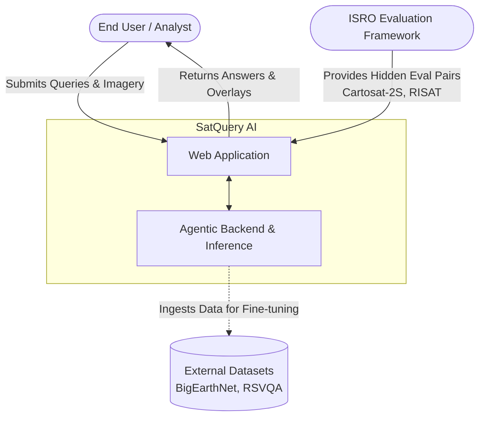
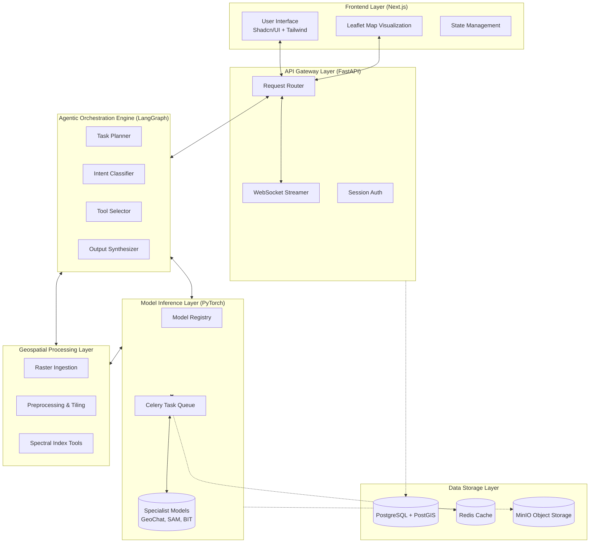
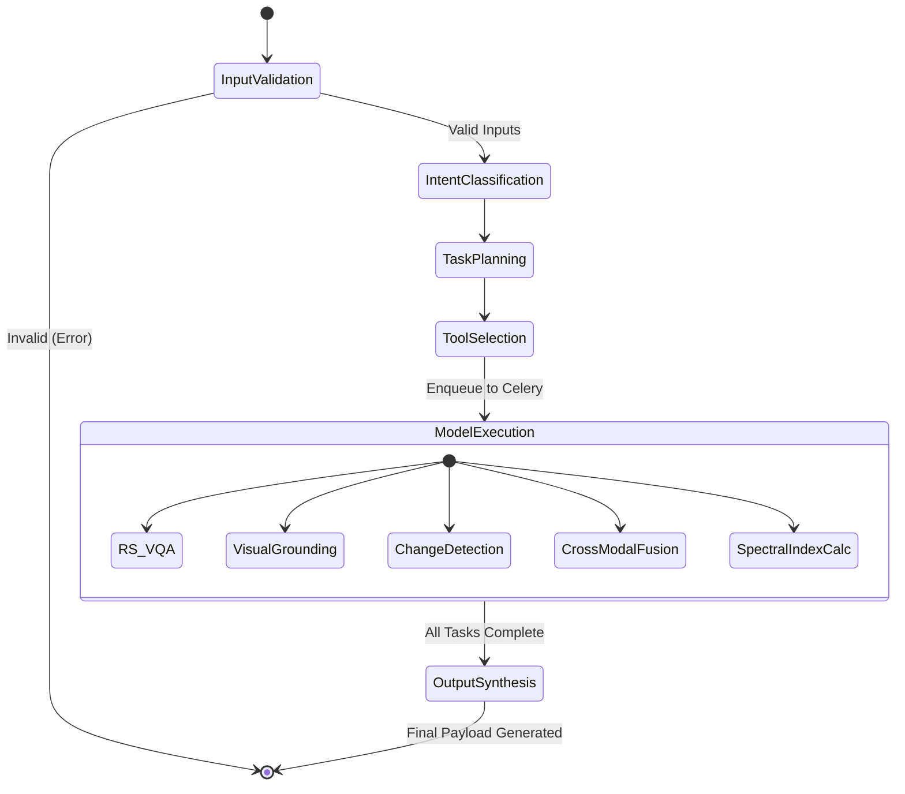
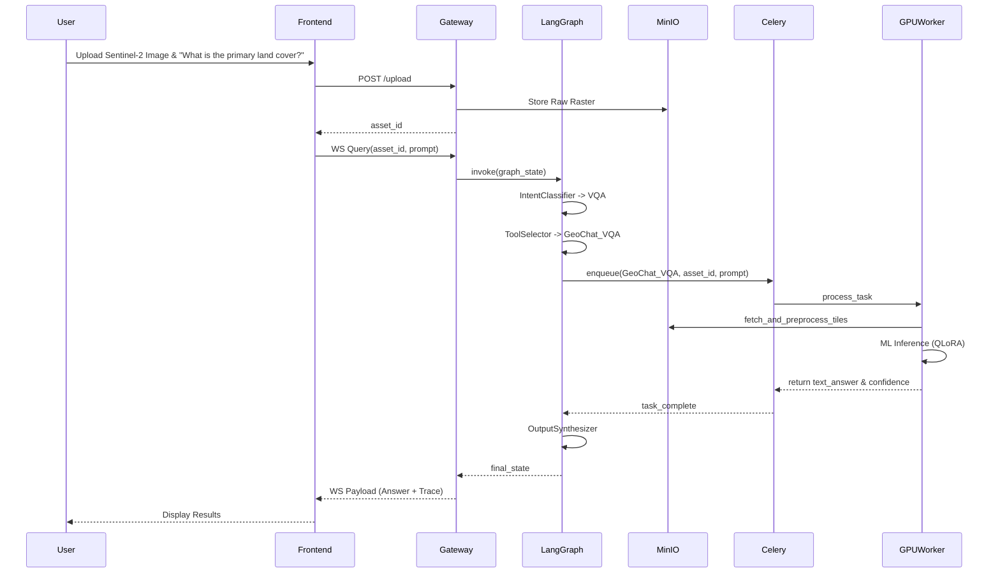
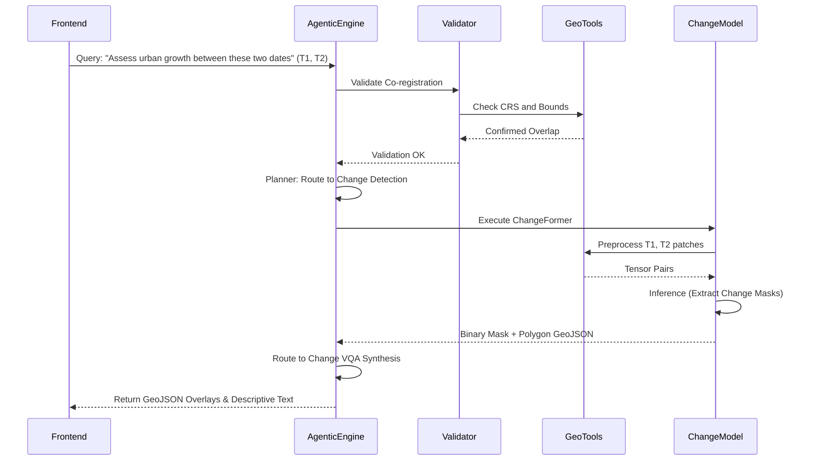
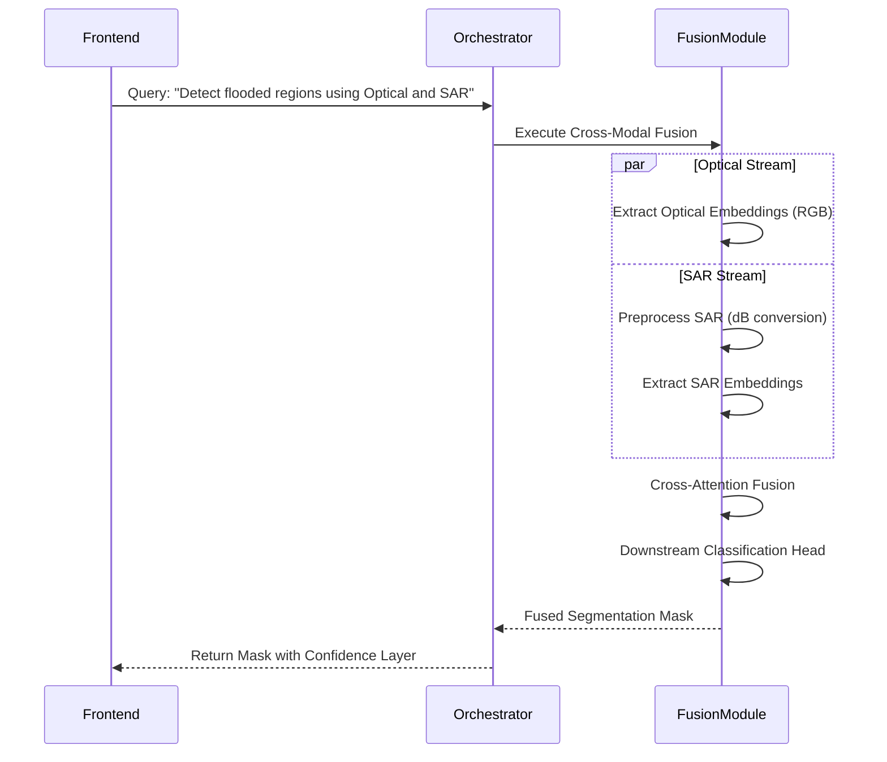
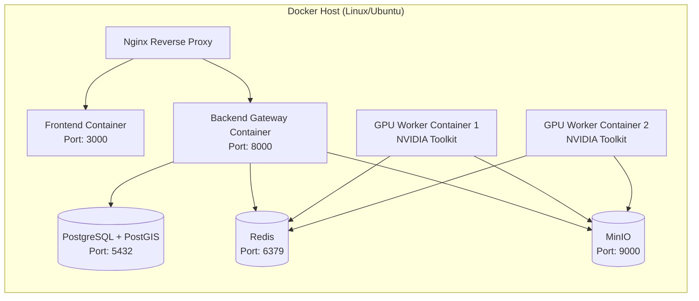

# System Architecture Document (SAD)

## 1. DOCUMENT CONTROL

| Attribute | Details |
| :--- | :--- |
| **Document Name** | System Architecture Document |
| **Project Name** | SatQuery AI |
| **Problem Statement ID** | PS ID 26167 |
| **Organization** | Indian Space Research Organisation (ISRO), Department of Space |
| **Version** | 1.0.0 |
| **Date** | 2026-09-09 |
| **Status** | Approved |

---

## 2. ARCHITECTURAL OVERVIEW

### 2.1 Architecture Style and Rationale

SatQuery AI is architected as a **Modular Monolith with an Agentic Orchestration Layer**. This design paradigm was selected to balance system cohesion, ease of deployment, and complex, dynamic execution flows required for multimodal remote sensing tasks. 

**Rationale:**
1. **Agentic Orchestration:** Unlike traditional deterministic pipelines, remote sensing query resolution (e.g., "Where are the new buildings built since last year in this area?") requires dynamic planning, tool selection, and synthesis. An agentic graph (implemented via LangGraph) allows the system to parse intent, plan a multi-step Directed Acyclic Graph (DAG) of tasks, execute specific machine learning models (VQA, Grounding, Change Detection), and synthesize the results logically.
2. **Modular Monolith:** A microservices architecture introduces significant overhead in network latency, especially when shuffling multi-gigabyte geospatial raster files across boundaries. A modular monolith allows tight integration of data layers and processing while maintaining strict logical boundaries between components (Frontend, Backend Gateway, Agent Engine, Model Inference, Geospatial Processing).
3. **Asynchronous Task Queue for Inference:** Inference on large geospatial rasters using large vision-language models (e.g., GeoChat 7B) requires significant GPU memory and time. A Celery and Redis-based asynchronous task queue ensures that the FastAPI gateway remains responsive and can multiplex incoming requests efficiently.

### 2.2 System Context Diagram

The System Context Diagram delineates the boundary of the SatQuery AI system, indicating interactions with external actors, data sources, and evaluation environments.

### 2.3 High-Level Component Diagram

The following diagram details the major internal subsystems and their physical boundaries within the modular monolith.

---

## 3. COMPONENT ARCHITECTURE

### 3.1 Frontend Layer

The Frontend Layer is responsible for user interaction, query submission, and the visualization of complex multimodal outputs. It is built using **Next.js 14**, utilizing App Router architecture, **TypeScript**, **Tailwind CSS**, and **Shadcn/UI**.

- **Application Structure:** 
  Next.js provides server-side rendering (SSR) for initial load performance and client-side routing for dynamic, SPA-like experiences.
- **Key Pages:**
  - **Upload Workspace:** An area for drag-and-drop ingestion of Single Optical, Single SAR, or Bi-Temporal pairs. It features client-side metadata extraction (using specialized lightweight WASM libraries if applicable, or server validation endpoints) to confirm valid formats (GeoTIFF/TIFF/PNG/JPEG).
  - **Query Interface:** A chat-like interface where the user formulates natural language requests linked to the uploaded assets.
  - **Results Dashboard:** Displays the final textual response.
  - **Execution Trace Viewer:** A dedicated panel that exposes the LangGraph execution trace, showing the user exactly which intent was classified, which tools were called, their execution times, and confidence scores. This satisfies the strict requirement for observability and auditability.
- **Leaflet Map Integration:** 
  For spatial overlay visualization, Leaflet (via React-Leaflet) is used. It overlays model outputs such as bounding boxes (from grounding models), binary masks (from change detection), and localized textual callouts dynamically over base maps or the user's imagery.
- **State Management:** 
  Complex application states (such as active queries, intermediate streaming tokens, and loaded geospatial layers) are managed using React Context and Zustand, enabling lightweight, performant re-renders.

### 3.2 API Gateway Layer

The API Gateway is the central entry point for the frontend, constructed using **FastAPI (Python 3.11+)**.

- **FastAPI Application Structure:** 
  Organized using APIRouter into logical domains: `/api/v1/auth`, `/api/v1/workspace`, `/api/v1/query`, and `/api/v1/spatial`.
- **Request Routing and Authentication:** 
  Handles stateless session management. Image uploads are securely routed to the internal MinIO bucket, and queries are encapsulated into job definitions.
- **WebSocket Support:** 
  Crucial for the user experience. Because agentic inference can take tens of seconds (especially when chaining multiple models), the gateway uses WebSockets to stream intermediate state from the Agentic Orchestration Engine. This provides the frontend with real-time updates (e.g., "Classified Intent as VQA", "Loading GeoChat Model", "Generating response tokens").

### 3.3 Agentic Orchestration Engine

The Agentic Orchestration Engine is the intellectual core of SatQuery AI, leveraging **LangGraph** (a lightweight agent graph framework built on LangChain).

- **LangGraph Agent Graph Design:** 
  Instead of a static script, queries traverse a finite state machine constructed as a Directed Acyclic Graph. State is maintained throughout the traversal, carrying the original query, image references, intermediate tool outputs, and the evolving execution trace.
- **Node Types:**
  - **InputValidator:** Ensures inputs meet constraints (e.g., verifying that a bi-temporal pair has matching geographic extents and CRS).
  - **IntentClassifier:** Utilizes a fast, quantized LLM prompt to map the natural language query into one of `{VQA, CAPTIONING, GROUNDING, CHANGE_DETECTION, CHANGE_VQA, CROSS_MODAL_ANALYSIS, SPECTRAL_INDEX}`.
  - **TaskPlanner:** For complex queries (e.g., "Find areas where water bodies diminished and describe the severity"), this node breaks the task into parallel or sequential tool calls (e.g., NDWI tool -> Change Detection -> VQA synthesis).
  - **ToolSelector:** Maps planned tasks to specific tools in the Model Registry.
  - **ModelExecutor:** Dispatches the execution request to the Celery task queue and waits for the asynchronous response.
  - **OutputSynthesizer:** Merges bounding boxes, masks, textual descriptions, and execution logs into a coherent final response payload.
- **Error Handling and Fallback Strategies:** 
  If a specialized model fails or is overly uncertain (low confidence score), the graph routes execution to a generic fallback node (e.g., reverting to a general description if fine-grained grounding fails) and alerts the user via the trace log. Graceful degradation is paramount.

#### State Machine / Graph Diagram

### 3.4 Model Inference Layer

The Model Inference Layer executes the heavy-duty ML computations using PyTorch 2.x and Hugging Face Transformers.

- **Model Registry Design Pattern:** 
  The system employs a strict registry pattern. Each specialized model (e.g., RS-VQA GeoChat 7B, Visual Grounding Grounding-DINO, Bi-Temporal ChangeFormer) implements a standardized interface (`predict(input_data, context)`). This ensures new models can be added without altering orchestration logic.
- **Celery Worker Pool Architecture:** 
  Requests for inference are pushed to a Redis broker. Celery workers, constrained to specific GPU resources, pull these jobs. This decouples the synchronous API from long-running GPU tasks.
- **GPU Memory Management Strategy:** 
  Given the requirement to run on NVIDIA T4 (16 GB) minimum or A100 recommended, the system aggressively utilizes **PEFT (QLoRA)**. Models are quantized (4-bit or 8-bit). 
- **Model Loading/Unloading:** 
  The layer implements an LRU (Least Recently Used) cache for loaded models. If a T4 is utilized, only one massive model (like GeoChat) resides in VRAM at a time. Switching tasks triggers a lazy unload of the current model and a load of the new one, optimizing limited VRAM at the cost of slight latency.

### 3.5 Geospatial Processing Layer

This layer acts as the bridge between raw Earth Observation data and the ML tensors, utilizing `rasterio`, `GDAL`, `pyproj`, and `shapely`.

- **GeoTIFF Ingestion Pipeline:** 
  Reads multi-band rasters (avoiding naive RGB conversion). Extracts essential metadata: CRS, resolution, bounds, acquisition date, and nodata values.
- **Band Extraction, Normalization, Tiling:** 
  Extracts specific bands required by target models (e.g., B4, B8 for NDVI). Applies min-max or percentile normalization. Implements a sliding window tiling algorithm to chunk large GeoTIFFs into the 512x512 or 1024x1024 patches expected by Vision Transformers.
- **SAR Preprocessing:** 
  Critically, handles Sentinel-1 / RISAT imagery by applying speckle filtering (e.g., Lee or Frost filter), radiometric calibration to Sigma0, and logarithmic conversion to decibels (dB) to compress the dynamic range for the ML models.
- **Co-registration Validation Algorithm:** 
  Before executing change detection, verifies that bi-temporal pairs precisely overlap geographically using their affine transform matrices and CRS definitions.
- **Spectral Index Computation:** 
  Non-ML algorithmic tools for NDVI, NDWI, NDBI, etc., executed directly via `numpy` matrix operations over raster arrays.

### 3.6 Data Storage Layer

- **PostgreSQL + PostGIS:** 
  The primary relational database. Stores user session metadata, query logs, system configuration, and evaluation benchmarks. PostGIS extensions are leveraged for bounding box intersections and spatial indexing of uploaded tiles.
- **Object Storage (MinIO):** 
  S3-compatible storage. Raw uploaded GeoTIFFs, intermediate cropped tiles, and output artifacts (rendered masks) are stored here.
- **Session and Trace Logging:** 
  Execution traces (including confidence scores and exact node traversal paths) are serialized as JSON documents and stored in PostgreSQL for auditability and dashboard rendering.

---

## 4. DATA FLOW DIAGRAMS

### 4.1 Single Image VQA Flow

### 4.2 Bi-Temporal Change Analysis Flow

### 4.3 Cross-Modal Optical-SAR Analysis Flow

---

## 5. DEPLOYMENT ARCHITECTURE

### 5.1 Docker Compose Topology

The system is deployed using a comprehensive Docker Compose configuration designed for portability across ISRO environments.

### 5.2 GPU Allocation Strategy

SatQuery AI supports heterogeneous GPU setups.
- **Minimum Setup (1x NVIDIA T4 16GB):** VRAM is strictly managed. GeoChat 7B is loaded in 4-bit quantization (~5GB VRAM). The remaining VRAM is used for batch inference tensors. Sequential execution is enforced.
- **Recommended Setup (1x or 2x NVIDIA A100 40GB/80GB):** Entire models (VQA, Grounding, ChangeFormer) are loaded simultaneously into memory, allowing parallel node execution in the LangGraph DAG, vastly reducing latency.

### 5.3 Environment Configuration

Configuration is managed entirely through environment variables (`.env`), encompassing database connection strings, model repository paths (local or Hugging Face hub), Redis queues, MinIO credentials, and VRAM management flags (e.g., `FORCE_8BIT_QUANTIZATION=True`).

---

## 6. CROSS-CUTTING CONCERNS

### 6.1 Logging and Observability

- Every API request is tagged with a unique `trace_id`.
- The Agentic Engine logs every state transition, intent classification score, tool selection rationale, and execution duration.
- Logs are stored in PostgreSQL and accessible via the **Execution Trace Viewer** on the frontend, ensuring high evaluation marks for clarity, auditability, and SIH criteria adherence.

### 6.2 Error Handling Strategy

1. **Input Validation Failures:** Immediate feedback to the user via UI toasts (e.g., "Images do not overlap").
2. **Model OOM (Out of Memory):** The Celery worker restarts, and the task is retried with a smaller tile size.
3. **Agent Graph Hallucination/Stalemate:** If the Intent Classifier fails to assign a task confidently, the system defaults to a standard "Captioning/Description" output and warns the user.

### 6.3 Security Considerations

- Images processed internally are isolated. MinIO buckets are not exposed publicly.
- No dynamic code execution is permitted via agentic tools; all tools are strictly deterministic Python functions or PyTorch model inferences.
- Database access is restricted via Docker internal networks.

### 6.4 Performance and Scalability

- **Caching:** Output from deterministic tools (like Spectral Index calculation) is cached using Redis based on the hash of the image and parameters.
- **Scalability:** The Celery worker pool can be horizontally scaled across multiple GPU nodes if distributed processing is required.

---

## 7. TECHNOLOGY STACK SUMMARY TABLE

| Layer | Technologies Used | Justification |
| :--- | :--- | :--- |
| **Frontend** | Next.js 14, TypeScript, Tailwind CSS, Shadcn/UI, Leaflet | Modern, reactive UI with robust mapping capabilities for geospatial overlays. |
| **Backend & APIs** | FastAPI, Python 3.11+, WebSockets | High performance, native async support, ideal for streaming LLM/Agent tokens. |
| **Orchestration** | LangGraph, LangChain | Lightweight state machine approach for agentic DAG execution. |
| **Machine Learning** | PyTorch 2.x, Hugging Face, PEFT (QLoRA) | Industry standard, robust support for quantizing large models like GeoChat. |
| **Geospatial Processing** | rasterio, GDAL, pyproj, shapely | Strict requirement for proper multi-band, CRS-aware raster processing. |
| **Asynchronous Queue** | Celery, Redis | Reliable task distribution for long-running GPU inference workloads. |
| **Database & Storage** | PostgreSQL, PostGIS, MinIO | Robust relational and spatial query support; S3-compatible local object storage. |
| **Infrastructure** | Docker, Docker Compose, NVIDIA Container Toolkit | Ensures reproducible, portable deployments across varying ISRO hardware. |

---
*End of Document*
