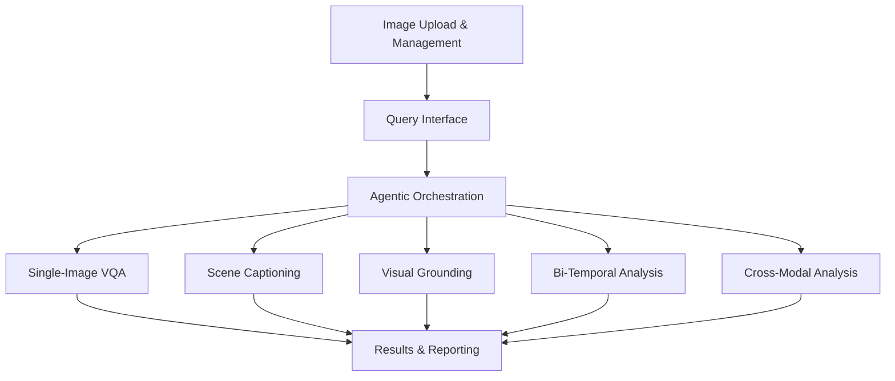

# Functional Requirements Specification

## 1. DOCUMENT CONTROL

| Document Name | Functional Requirements Specification |
| :--- | :--- |
| **Project Name** | SatQuery AI |
| **Problem Statement ID** | PS ID 26167 |
| **Version** | 1.0 |
| **Date** | 2026-09-09 |
| **Status** | Final |

## 2. SCOPE AND PURPOSE

This document outlines the functional requirements for SatQuery AI, an interactive vision-language assistant designed for multimodal remote sensing image analysis through text queries. The purpose of this specification is to define the exact functionalities, features, and system behaviors expected by end users and stakeholders. It serves as a definitive guide for the development, testing, and evaluation of the system, ensuring alignment with the requirements set forth by the Indian Space Research Organisation (ISRO).

## 3. USER ROLES AND ACTORS

1. **End User**: A remote sensing analyst, researcher, or operator who interacts with the system to query satellite imagery, generate reports, and extract geospatial intelligence.
2. **System Administrator**: Responsible for system deployment, configuration, model updates, and monitoring of system health and performance.
3. **ISRO Evaluator**: A specialized user role representing hackathon judges or ISRO personnel evaluating the system against the problem statement criteria (novelty, complexity, feasibility, user experience).

## 4. FUNCTIONAL REQUIREMENTS

### 4.1 Image Upload and Management

| ID | Description | Priority | Acceptance Criteria | Traceability |
| :--- | :--- | :--- | :--- | :--- |
| FR-IMG-001 | The system shall accept single image uploads in supported formats (GeoTIFF, TIFF, PNG, JPEG). | Mandatory | Successfully uploads and stores the file, returning a unique asset ID. | PS-26167 |
| FR-IMG-002 | The system shall extract and display geospatial metadata (CRS, resolution, bounds, acquisition date, band count) from GeoTIFF headers. | Mandatory | Metadata is accurately parsed and presented in the UI immediately post-upload. | PS-26167 |
| FR-IMG-003 | The system shall automatically detect and validate the band configuration (e.g., optical RGB, multispectral, SAR VV/VH). | Mandatory | Rejects unsupported band configurations with a descriptive error; accepts valid configurations. | PS-26167 |
| FR-IMG-004 | The system shall support the upload and registration of bi-temporal image pairs (same location, different times). | Mandatory | Validates that both images share the same geographic extent and CRS. | PS-26167 |
| FR-IMG-005 | The system shall support the upload and registration of cross-modal image pairs (e.g., co-registered Optical and SAR). | Mandatory | Validates spatial overlap and co-registration parameters. | PS-26167 |
| FR-IMG-006 | The system shall generate and display lightweight RGB or false-color thumbnails for large GeoTIFFs. | Mandatory | Thumbnail is generated in under 3 seconds and displayed in the Leaflet map view. | PS-26167 |

### 4.2 Natural Language Query Interface

| ID | Description | Priority | Acceptance Criteria | Traceability |
| :--- | :--- | :--- | :--- | :--- |
| FR-QRY-001 | The system shall provide a text input field for users to submit natural language queries. | Mandatory | Accepts free-text input and handles special characters appropriately. | PS-26167 |
| FR-QRY-002 | The system shall maintain a chronological history of queries and responses within a session. | Mandatory | Users can scroll through previous interactions in a chat-like interface. | PS-26167 |
| FR-QRY-003 | The system shall provide context-aware suggested queries based on the uploaded image type (e.g., suggesting change detection queries for bi-temporal pairs). | Optional | Displays 3-5 clickable query suggestions upon successful image upload. | PS-26167 |

### 4.3 Agentic Orchestration

| ID | Description | Priority | Acceptance Criteria | Traceability |
| :--- | :--- | :--- | :--- | :--- |
| FR-AGT-001 | The system shall classify the intent of the user query into predefined tasks (VQA, CAPTIONING, GROUNDING, CHANGE_DETECTION, CHANGE_VQA, CROSS_MODAL_ANALYSIS, SPECTRAL_INDEX). | Mandatory | LLM classifier assigns the correct task category with >90% accuracy on a validation set. | PS-26167 |
| FR-AGT-002 | The system shall dynamically generate an execution plan (DAG) of necessary tool invocations based on query intent and input type. | Mandatory | Planner constructs a valid sequence of tool calls (e.g., spectral index calculation followed by grounding). | PS-26167 |
| FR-AGT-003 | The system shall select the appropriate model from the registry based on the required task and image modality. | Mandatory | Selects GeoChat for single VQA, ChangeFormer for bi-temporal, etc. | PS-26167 |
| FR-AGT-004 | The system shall generate and display a detailed execution trace of the agent's thought process, tool selection, and execution steps. | Mandatory | Trace log is visible to the user, showing selected tasks, parameters, and timing. | PS-26167 |

### 4.4 Single-Image VQA

| ID | Description | Priority | Acceptance Criteria | Traceability |
| :--- | :--- | :--- | :--- | :--- |
| FR-VQA-001 | The system shall answer natural language questions about the content of a single optical, multispectral, or SAR image. | Mandatory | Returns a relevant, text-based answer utilizing the RS-VQA model (GeoChat). | PS-26167 |
| FR-VQA-002 | The system shall provide a confidence score (0-100%) for generated answers. | Mandatory | Confidence score is computed and displayed alongside the textual response. | PS-26167 |

### 4.5 Scene Captioning / Description

| ID | Description | Priority | Acceptance Criteria | Traceability |
| :--- | :--- | :--- | :--- | :--- |
| FR-CAP-001 | The system shall generate comprehensive natural-language scene descriptions for a given image. | Mandatory | Outputs a descriptive paragraph summarizing land cover, structures, and key features. | PS-26167 |

### 4.6 Visual Grounding

| ID | Description | Priority | Acceptance Criteria | Traceability |
| :--- | :--- | :--- | :--- | :--- |
| FR-GRD-001 | The system shall locate specific objects or regions mentioned in the text query within the image. | Mandatory | Returns coordinates for bounding boxes corresponding to the queried entity. | PS-26167 |
| FR-GRD-002 | The system shall generate pixel-level segmentation masks for grounded entities using the Visual Grounding Model. | Mandatory | Overlays high-resolution segmentation masks on the original image view. | PS-26167 |

### 4.7 Bi-Temporal Change Analysis

| ID | Description | Priority | Acceptance Criteria | Traceability |
| :--- | :--- | :--- | :--- | :--- |
| FR-CHG-001 | The system shall compute binary or multi-class change maps between bi-temporal image pairs. | Mandatory | Generates a raster overlay highlighting areas of change. | PS-26167 |
| FR-CHG-002 | The system shall describe identified changes in natural language. | Mandatory | Outputs text detailing the nature of the change (e.g., "urban expansion detected"). | PS-26167 |
| FR-CHG-003 | The system shall answer specific questions regarding changes between two temporal images (Change VQA). | Mandatory | Accurately responds to queries like "What changed in the northwest region?". | PS-26167 |

### 4.8 Cross-Modal Optical-SAR Analysis

| ID | Description | Priority | Acceptance Criteria | Traceability |
| :--- | :--- | :--- | :--- | :--- |
| FR-FUS-001 | The system shall extract joint features from co-registered optical and SAR images using the cross-attention fusion module. | Mandatory | Successfully fuses data for downstream land-cover or feature delineation. | PS-26167 |
| FR-FUS-002 | The system shall leverage SAR properties (e.g., texture, backscatter) to resolve ambiguities in optical data (e.g., cloud cover) when queried. | Mandatory | Answers queries correctly by utilizing the complementary SAR data where optical is insufficient. | PS-26167 |

### 4.9 Results and Reporting

| ID | Description | Priority | Acceptance Criteria | Traceability |
| :--- | :--- | :--- | :--- | :--- |
| FR-RPT-001 | The system shall render visual evidence (bounding boxes, masks, change maps) overlaid on the base image using Leaflet. | Mandatory | Overlays are interactive (toggle visibility) and accurately aligned geographically. | PS-26167 |
| FR-RPT-002 | The system shall allow users to download a summary report of the session, including images, queries, answers, and execution traces. | Optional | Generates a formatted PDF or Markdown export of the analysis session. | PS-26167 |

## 5. REQUIREMENT PRIORITY MATRIX

| Module | Mandatory Requirements | Optional Requirements | Total |
| :--- | :--- | :--- | :--- |
| Image Upload and Management | 6 | 0 | 6 |
| Natural Language Query Interface | 2 | 1 | 3 |
| Agentic Orchestration | 4 | 0 | 4 |
| Single-Image VQA | 2 | 0 | 2 |
| Scene Captioning / Description | 1 | 0 | 1 |
| Visual Grounding | 2 | 0 | 2 |
| Bi-Temporal Change Analysis | 3 | 0 | 3 |
| Cross-Modal Analysis | 2 | 0 | 2 |
| Results and Reporting | 1 | 1 | 2 |
| **Total** | **23** | **2** | **25** |

## 6. REQUIREMENT DEPENDENCIES

*   **Agentic Orchestration (FR-AGT-*)** depends heavily on successful **Image Upload (FR-IMG-*)** and input parsing.
*   All specialized modeling tasks (**FR-VQA-*, FR-CAP-*, FR-GRD-*, FR-CHG-*, FR-FUS-***) rely on the **Agentic Orchestration** module correctly routing and formulating the execution plan.
*   **Results and Reporting (FR-RPT-*)** aggregates outputs from all modeling modules and the orchestration trace.
