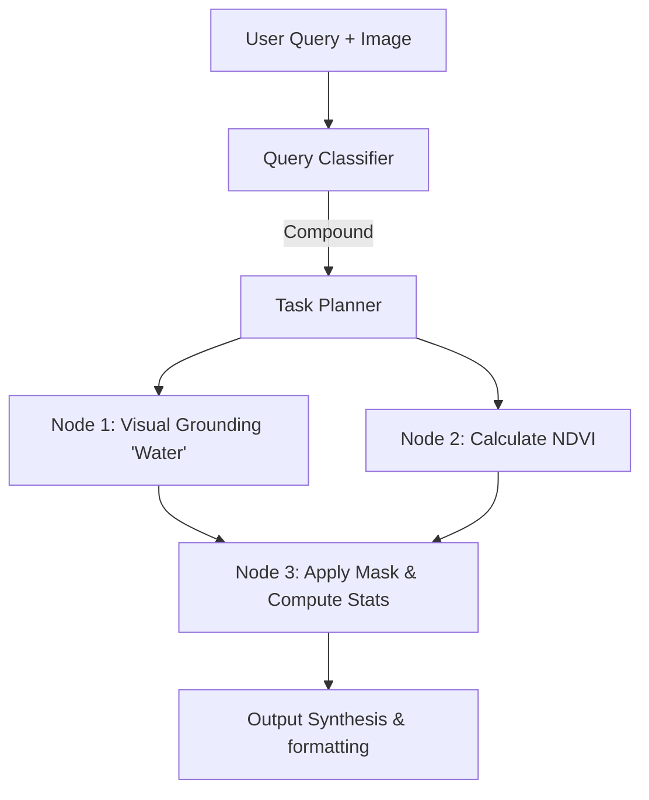

# Technical Design Document — Model Registry, AI Pipelines, and Agentic Orchestration

## 1. DOCUMENT CONTROL

| Attribute | Details |
| :--- | :--- |
| **Document Name** | Technical Design Document — Model Registry, AI Pipelines, and Agentic Orchestration |
| **System Name** | SatQuery AI |
| **Problem Statement ID** | PS ID 26167 |
| **Organization** | Indian Space Research Organisation (ISRO), Department of Space |
| **Version** | 1.0.0 |
| **Date** | 2026-09-09 |
| **Status** | Approved for Implementation |

---

## 2. MODEL REGISTRY ARCHITECTURE

The Model Registry in SatQuery AI is the core subsystem responsible for managing the lifecycle, configuration, and execution context of all machine learning models and non-ML tools. It ensures that the agentic orchestration layer can discover, instantiate, and execute specialized models seamlessly.

### 2.1 Registry Design Pattern

The registry employs a dynamic registration pattern using an Abstract Base Class (ABC) combined with Python decorators. This allows new models or tools to be added to the system without modifying the core orchestration logic.

```python
from abc import ABC, abstractmethod
from typing import Dict, Any, List, Optional
import pydantic

class BaseToolMetadata(pydantic.BaseModel):
    name: str
    version: str
    task_types: List[str]
    input_spec: Dict[str, Any]
    output_spec: Dict[str, Any]
    resource_requirements: Dict[str, Any]
    description: str

class SatQueryTool(ABC):
    @classmethod
    @abstractmethod
    def get_metadata(cls) -> BaseToolMetadata:
        pass

    @abstractmethod
    def initialize(self) -> None:
        pass

    @abstractmethod
    def execute(self, inputs: Dict[str, Any]) -> Dict[str, Any]:
        pass

    @abstractmethod
    def shutdown(self) -> None:
        pass

# Registry mapping
_TOOL_REGISTRY: Dict[str, Type[SatQueryTool]] = {}

def register_tool(name: str):
    def decorator(cls):
        _TOOL_REGISTRY[name] = cls
        return cls
    return decorator
```

### 2.2 Model Metadata Schema

Each registered tool must expose its metadata conforming to a strict schema. This schema is utilized by the Agentic Planner to verify input compatibility and resource availability before scheduling a task.

*   **`name`**: Unique identifier for the model (e.g., `rs_vqa_geochat_7b`).
*   **`version`**: Semantic versioning string.
*   **`task_types`**: Supported tasks from the classification taxonomy (e.g., `["VQA", "CAPTIONING"]`).
*   **`input_spec`**: Expected input payload structure, including data types (e.g., `GeoTIFF`, `String`) and spatial constraints.
*   **`output_spec`**: Guaranteed output structure (e.g., bounding boxes, text, raster map).
*   **`resource_requirements`**: Minimum VRAM, required CUDA version, and expected maximum inference time.

### 2.3 Model Lifecycle Management

The lifecycle of models is managed to optimize GPU utilization, given that keeping all models in VRAM simultaneously is generally unfeasible outside of enterprise clustered environments.

1.  **Lazy Loading**: Models are not loaded into GPU memory at application startup. They are loaded asynchronously upon the first request that necessitates their use.
2.  **Inference Execution**: Execution is offloaded to Celery workers pinned to specific GPUs.
3.  **Eviction/Unloading**: An LRU (Least Recently Used) cache policy combined with a VRAM monitor tracks model usage. If a new model requires loading and VRAM is insufficient, the least recently used model is serialized to host memory or completely offloaded until needed again.
4.  **Versioning**: The registry supports multiple versions of the same model via namespacing, allowing A/B testing of new fine-tuned checkpoints without system downtime.

---

## 3. SPECIALIST MODEL SPECIFICATIONS

The SatQuery AI pipeline leverages a suite of distinct models and tools, each specialized for remote sensing modalities and specific analytical tasks.

### 3.1 RS-VQA Model

The core visual question answering component designed for single optical, multispectral, or SAR imagery.

*   **Base Model**: GeoChat (7B), fundamentally built upon the Qwen-7B-Chat or LLaVA architecture, adapted for remote sensing.
*   **Fine-tuning Strategy**: Parameter-Efficient Fine-Tuning (PEFT) using QLoRA.
    *   **Quantization**: 4-bit NormalFloat (NF4) via BitsAndBytes.
    *   **LoRA Parameters**: `rank=16`, `alpha=32`, applied to all linear layers (q_proj, k_proj, v_proj, o_proj, gate_proj, up_proj, down_proj) to maximize adaptation capability while minimizing VRAM footprint.
*   **Training Data**: 
    *   RSVQA-LR (Low Resolution) and RSVQA-HR (High Resolution) datasets.
    *   BigEarthNet.txt (synthesized QA pairs based on image labels).
*   **Input Preprocessing**:
    *   Band selection: If >3 bands, mapping to RGB or false-color composites using standard mapping protocols (e.g., Sentinel-2 B4, B3, B2 to RGB).
    *   Normalization: Min-max scaling using dynamic percentiles (2nd and 98th) to handle outliers in 16-bit GeoTIFFs.
    *   Resizing: Bicubic interpolation to model's expected resolution (e.g., 448x448 or 336x336 for ViT embedding).
*   **Output Format**: 
    ```json
    {
      "answer": "There are 4 storage tanks visible.",
      "confidence": 0.92
    }
    ```
*   **Evaluation Metrics**: Overall Accuracy (OA) and Average Accuracy (AA) against the RSVQA test splits.

### 3.2 RS-Captioning Model

Generates comprehensive natural-language scene descriptions.

*   **Architecture**: Shares the GeoChat (7B) backbone with the RS-VQA model but utilizes a specific system prompt and task-specific LoRA adapters (swappable at runtime).
*   **Training Data**: VRSBench (captioning split) and BigEarthNet.txt descriptive annotations.
*   **Output Format**:
    ```json
    {
      "caption": "A high-resolution optical image showing a suburban area with densely packed residential houses, a small park in the center, and a multi-lane highway running along the eastern edge.",
      "confidence": 0.88
    }
    ```
*   **Evaluation Metrics**: BLEU-4, METEOR, CIDEr, evaluated on the VRSBench test set.

### 3.3 Visual Grounding Model

Translates natural language descriptions into precise spatial locations within the image.

*   **Architecture**: Grounding-DINO (Swin-T backbone) paired with Segment Anything Model (SAM, ViT-B backbone).
*   **Domain Adaptation Approach**: 
    *   Zero-shot transfer of Grounding-DINO often fails on overhead imagery due to scale and perspective differences.
    *   The model undergoes continued pre-training on bounding-box annotated remote sensing datasets (like DIOR and DOTA translated to natural language prompts).
    *   Pipeline: Text Query -> Grounding-DINO -> Bounding Boxes -> SAM Prompting -> Segmentation Masks.
*   **Input**: Normalized Image Array + Text Query (e.g., "Find all circular storage tanks").
*   **Output Format**:
    ```json
    {
      "bboxes": [[120, 150, 180, 210], [300, 45, 360, 105]],
      "masks": ["<base64_encoded_binary_mask_1>", "<base64_encoded_binary_mask_2>"],
      "confidence": [0.85, 0.79]
    }
    ```
*   **Evaluation Metrics**: Accuracy@0.5 (Intersection over Union threshold of 0.5) on VRSBench grounding split.

### 3.4 Bi-Temporal Change Detection Model

Identifies pixel-level changes between two aligned images of the same geographic area taken at different times.

*   **Architecture**: Bitemporal Image Transformer (BIT) or ChangeFormer. These models utilize Siamese Transformer encoders to extract features from T1 and T2, followed by a decoder that computes difference features and predicts a change probability map.
*   **Input**: A strictly co-registered image pair (T1, T2) with identical spatial dimensions and Coordinate Reference System (CRS).
*   **Preprocessing**:
    *   Co-alignment verification (automated fallback to feature matching if spatial extents deviate).
    *   Independent normalization of both temporal periods to account for differing atmospheric conditions.
*   **Output**: Binary or multi-class change map representing altered pixels (returned as a georeferenced raster).
*   **Post-processing**: Morphological operations (opening/closing) to remove speckle noise and connected component analysis to filter out insignificantly small change artifacts.

### 3.5 Change VQA Model

Answers complex natural language questions about the differences between two temporal states.

*   **Architecture**: A fine-tuned lightweight Vision-Language Model (VLM). It takes concatenated temporal features or processes the generated change map alongside the base images.
*   **Training Data**: CDVQA (Change Detection Visual Question Answering) dataset.
*   **Input**: Bi-temporal image pair (T1, T2) + Natural language question (e.g., "What type of building was constructed in the highlighted area?").
*   **Output Format**:
    ```json
    {
      "answer": "A large commercial warehouse was constructed.",
      "confidence": 0.81,
      "change_map": "<optional_uri_to_relevant_change_raster>"
    }
    ```
*   **Evaluation Metrics**: Overall Accuracy (OA), Average Accuracy (AA) on CDVQA.

### 3.6 Optical-SAR Fusion Module

Integrates multi-modal data to perform robust classification, overcoming limitations of single modalities (e.g., optical cloud cover, SAR layover/shadow).

*   **Architecture**: Dual-encoder with cross-attention fusion.
    *   Optical Encoder: ResNet-50 or ViT extracting features from RGB/Multispectral.
    *   SAR Encoder: Dedicated ResNet-50 extracting features from SAR (VV/VH polarizations).
    *   Fusion Block: Cross-attention mechanism where Optical features act as queries, and SAR features act as keys/values (and vice-versa).
    *   Classification Head: Multi-Layer Perceptron (MLP).
*   **Training**: BigEarthNet.txt paired optical-SAR data splits.
*   **Fusion Strategy Justification**: Early fusion (concatenating raw pixels) fails due to fundamentally different data distributions. Late fusion (averaging predictions) ignores feature-level synergies. Cross-attention is chosen as it allows the network to dynamically learn which modality to trust for specific features (e.g., trusting SAR for water boundaries, optical for vegetation type).
*   **Output**: Land cover classification probabilities, built-up area masks, and water delineation maps.

### 3.7 Spectral Index Calculator (Non-ML Tool)

A deterministic, mathematical tool for standard remote sensing indices, operating significantly faster and more accurately than ML approximations for these specific tasks.

*   **Supported Indices**: 
    *   NDVI (Normalized Difference Vegetation Index)
    *   NDWI (Normalized Difference Water Index)
    *   NDBI (Normalized Difference Built-up Index)
    *   EVI (Enhanced Vegetation Index)
    *   SAVI (Soil Adjusted Vegetation Index)
    *   MNDWI (Modified NDWI)
*   **Implementation**: Utilizes `numpy` and `rasterio` for highly vectorized computation. Requires dynamic band mapping configurations for different sensors (e.g., Sentinel-2 vs. Cartosat-2S).
*   **Output**: 
    *   Single-band float32 raster.
    *   Statistical summary payload containing `min`, `max`, `mean`, `std`, and `histogram` bins.

### 3.8 Metadata Extraction Tool (Non-ML Tool)

A foundational utility for the agent to understand the spatial context of user uploads.

*   **Implementation**: Utilizes GDAL/`rasterio` headers without loading image data arrays into memory.
*   **Extracts**:
    *   `CRS` (Coordinate Reference System, e.g., EPSG:32643).
    *   `spatial_resolution` (Pixel size in X/Y).
    *   `bounding_box` (Geographic or projected coordinates).
    *   `acquisition_date` (Parsed from TIFF tags if available).
    *   `band_count` and `data_type` (e.g., uint16, float32).
    *   `nodata` value.

---

## 4. AGENTIC ORCHESTRATION DETAILED DESIGN

SatQuery AI utilizes LangGraph to create a stateful, cyclical, multi-agent framework capable of planning, executing, and synthesizing results.

### 4.1 Query Intent Classification

Before processing, the raw user query must be classified to determine the required pipeline.

*   **Classification Taxonomy**: 
    `{VQA, CAPTIONING, GROUNDING, CHANGE_DETECTION, CHANGE_DESCRIPTION, CHANGE_VQA, CROSS_MODAL_ANALYSIS, SPECTRAL_INDEX, METADATA_QUERY, COMPOUND}`
*   **Implementation**: A fast, low-latency LLM (e.g., Gemma 2B or Phi-3 Mini) acts as the router. It is prompted with few-shot examples mapping natural language to taxonomy classes.
*   **Compound Query Decomposition**: If the classifier detects multiple intents (e.g., "Calculate NDVI and tell me what changed since last year"), it tags the query as `COMPOUND` and passes it to the Task Planner for decomposition.

### 4.2 Input Validation Pipeline

A rigid validation layer runs asynchronously alongside intent classification to fail fast on invalid data.

1.  **Format Validation**: Verifies magic bytes to ensure the file is a valid TIFF/GeoTIFF, preventing malicious payloads or unsupported formats.
2.  **Modality Detection**: Heuristics are applied to differentiate Optical vs. SAR.
    *   Optical: Typically 3, 4, 8, or 13 bands. Pixel values often well distributed across uint8/uint16 range.
    *   SAR: Typically 1 or 2 bands (VV, VH). Pixel values often exhibit specific distributions (e.g., speckle noise patterns) and may be stored as complex numbers or float32 dB values. Metadata tags (like Sentinel-1 product identifiers) are prioritized.
3.  **Co-registration Check**: When a bi-temporal pair is provided, the system cross-references the bounding boxes and spatial resolution extracted by the Metadata Tool. If overlap is < 95% or resolution mismatch is > 5%, execution is halted, or a resampling pre-step is dynamically added.

### 4.3 Task Planning (DAG Construction)

For `COMPOUND` queries, the system dynamically constructs a Directed Acyclic Graph (DAG) of tasks.

*   **Mechanism**: The LLM Planner analyzes the decomposed intents and determines dependencies.
*   **Dependency Resolution**:
    *   Task A relies on data from the user -> Parallel execution possible.
    *   Task B relies on output from Task A -> Sequential execution.
*   **Example DAG**: "Find the water bodies and calculate their NDVI."
    1.  Node 1: `Visual Grounding` -> Extracts mask of "water bodies".
    2.  Node 2: `Spectral Index Calculator (NDVI)` -> Computes full NDVI raster.
    3.  Node 3: `Output Synthesis (Masking)` -> Applies Node 1 mask to Node 2 raster, calculates masked statistics.



### 4.4 Tool Selection Logic

The agent utilizes a combination of rule-based routing and LLM flexibility.

*   **Primary Logic**: The agent uses the `task_type` matched from the classifier to look up registered tools. If exactly one tool exists for the task, it is selected.
*   **Fallback Strategies**:
    *   If a highly specialized model (e.g., `rs_vqa_geochat_7b`) fails due to OOM (Out of Memory) or timeout, the agent catches the exception and attempts a fallback.
    *   Fallback might involve attempting a more generic model, dropping image resolution before retrying, or returning a graceful degradation message to the user explaining the partial failure.

### 4.5 Output Synthesis

The final stage of the DAG execution.

*   **Textual Synthesis**: The agent's LLM takes JSON outputs from all executed tools and drafts a cohesive natural language response.
*   **Spatial Composition**: Grounding masks, bounding boxes, and change maps are transformed into GeoJSON features or colored overlay rasters to be served to the Next.js frontend via Leaflet mapping libraries.
*   **Confidence Aggregation**:
    *   For single tool paths: Direct passthrough.
    *   For composite paths (e.g., VQA answering based on Grounding output): The system utilizes a pessimistic approach, often applying the `minimum` confidence score of the chain, or calculating a weighted average based on empirical tool reliability.

### 4.6 Execution Trace Schema

A complete audit trail is generated for every query to ensure observability and transparency in the AI's decision-making process.

```json
{
  "query_id": "req-987654321",
  "timestamp": "2026-09-09T20:46:17Z",
  "original_query": "Identify the affected flooded regions and describe the impact.",
  "classification": "COMPOUND",
  "execution_dag": {
    "nodes": [
      {"id": "step_1", "tool": "visual_grounding_sam", "status": "SUCCESS", "latency_ms": 2450},
      {"id": "step_2", "tool": "rs_captioning_geochat", "status": "SUCCESS", "latency_ms": 3100}
    ],
    "edges": []
  },
  "overall_confidence": 0.82,
  "system_warnings": []
}
```

---

## 5. INFERENCE OPTIMIZATION

Given the heavy computational requirements of running multiple large models concurrently, several optimization techniques are employed.

### 5.1 Quantization Strategy

*   **4-bit QLoRA**: The primary mechanism for loading 7B parameter models (like GeoChat) onto consumer/mid-range hardware (e.g., NVIDIA T4 16GB). Quantizing the base weights to 4-bit NormalFloat reduces the footprint from ~14GB (FP16) to roughly 4.5GB.
*   **Alternative Support**: The model registry supports loading weights quantized via AWQ (Activation-aware Weight Quantization) or GPTQ if deployed on server architectures supporting these accelerated kernels.

### 5.2 Batching and Scheduling

*   **Celery/Redis Queue**: Inference requests are not executed synchronously within the FastAPI thread pool. They are dispatched to a Celery queue.
*   **Dynamic Batching**: If the queue depth increases, the inference worker can group identical task requests (e.g., multiple NDVI calculations or identical VQA models with different images) into single batched tensor operations, significantly improving throughput at the cost of slight latency increases for the first request in the batch.

### 5.3 Model Parallelism Considerations

For deployments on robust hardware (e.g., A100 80GB), models can be distributed. While tensor parallelism is not strictly necessary for a 7B model, pipeline parallelism can be used to load distinct models (e.g., Grounding-DINO on GPU 0, GeoChat on GPU 1) to enable true asynchronous execution of DAG branches.

### 5.4 Latency Budget Breakdown

Target latency for a standard VQA query: **< 5.0 seconds**

*   Input Validation & Preprocessing: 0.2s
*   Agent Classification & Routing: 0.5s
*   Model Loading (if cached): 0.1s
*   Model Inference (GPU): 2.5s - 3.5s
*   Output Synthesis: 0.5s
*   Network Overhead: 0.2s

---

## 6. ERROR HANDLING IN AI PIPELINE

Robust error handling is critical to ensure the agentic system remains stable and predictable.

### 6.1 Model Inference Failures

*   **OOM Errors**: Caught by the Celery worker. Triggers the Model Lifecycle Manager to aggressively clear VRAM caches. The task is re-queued with a higher priority and a flag to use a lower-resolution image input.
*   **NaN Outputs**: If a model produces invalid tensors (NaNs), a `ModelInferenceException` is raised, alerting the synthesis layer to rely on fallback tools or report failure.

### 6.2 Unsupported Input Handling

*   Inputs failing validation (e.g., 5-band combinations lacking a known spectral mapping) immediately short-circuit the pipeline. The LLM synthesis layer returns a clear, actionable error to the user: *"Unsupported band configuration detected. Please provide standard RGB, 4-band, or supported Sentinel-2/Landsat metadata."*

### 6.3 Low-Confidence Result Handling

*   If a model returns a confidence score below a defined threshold (e.g., < 0.40), the agent flags the result.
*   The final response includes a warning to the user: *"The system produced an answer but with low confidence. Consider clarifying the query or providing a clearer image."*

### 6.4 Timeout and Resource Exhaustion

*   Each node in the execution DAG has a hard timeout limit defined in its metadata `resource_requirements`.
*   If a timeout occurs, the DAG execution halts. The user receives a partial trace and a notification indicating which specific analytical step failed to complete within the permitted window.

---
*End of Technical Design Document*
