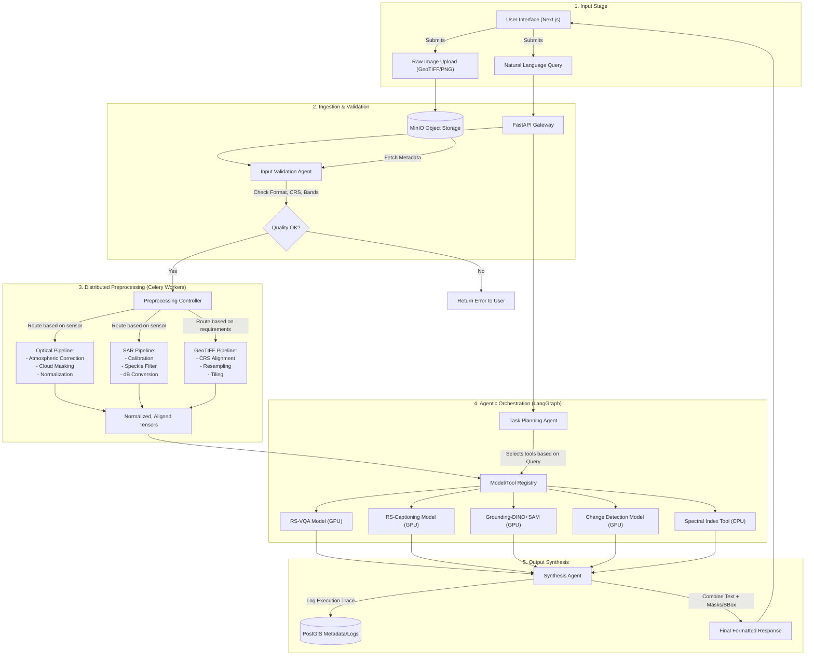

# Data Strategy and Dataset Documentation

## 1. DOCUMENT CONTROL

| Document Information | Details |
| :--- | :--- |
| Document Title | Data Strategy and Dataset Documentation |
| System Name | SatQuery AI |
| Problem Statement | PS ID 26167 — SatQuery AI - An Interactive Vision-Language Assistant for Multimodal Remote Sensing Image Analysis through Text Queries |
| Organization | Indian Space Research Organisation (ISRO), Department of Space |
| Version | 1.0.0 |
| Status | Approved for Implementation |
| Classification | Restricted - Project Team and Evaluating Committee Only |

This document defines the comprehensive data strategy for the SatQuery AI system. It details the datasets utilized for model adaptation and evaluation, the standardized preprocessing pipelines for various sensor modalities (Optical/Multispectral and SAR), data augmentation techniques, training data preparation protocols, and rigorous data quality assurance mechanisms. The guidelines established herein ensure that the multi-modal agentic architecture of SatQuery AI operates on high-fidelity, appropriately normalized input data, maximizing the reliability and accuracy of downstream vision-language tasks.

## 2. DATASET INVENTORY

The SatQuery AI system leverages a carefully curated collection of datasets to facilitate multi-modal learning, domain adaptation, and rigorous performance evaluation across distinct vision-language tasks in the remote sensing domain.

### 2.1 BigEarthNet.txt

BigEarthNet.txt serves as the primary dataset for adapting pre-trained Vision-Language Models (VLMs) to the unique visual vocabulary and structural characteristics of multimodal remote sensing imagery.

*   **Source:** Derived from the foundational BigEarthNet archive, enhanced with rich textual annotations (arXiv:2603.29630).
*   **Content:** The dataset consists of geographically co-registered pairs of Sentinel-1 Synthetic Aperture Radar (SAR) and Sentinel-2 multispectral images, paired with diverse, human-verified text annotations describing scene content, land cover semantics, and spatial relationships.
*   **Size and Statistics:** Contains over 500,000 multimodal image patches (120x120 pixels at 10m resolution), spanning multiple seasons and geographic regions across Europe.
*   **Band Information:**
    *   **Sentinel-2 (Multispectral):** 12 bands encompassing visible (B2, B3, B4), near-infrared (B8, B8A), short-wave infrared (B11, B12), and atmospheric correction bands (B1, B9, B10). Spatial resolutions vary from 10m to 60m.
    *   **Sentinel-1 (SAR):** Dual-polarization bands (VV, VH) acquired in Interferometric Wide Swath (IW) mode, providing information on surface roughness and volumetric scattering regardless of cloud cover.
*   **Text Annotation Types:** Annotations range from single-label land cover classifications to complex natural language descriptions detailing the composition, distribution, and relative positioning of various geographical entities within the scene.
*   **Licensing:** Open-access for research and non-commercial development purposes.
*   **Role in SatQuery AI:** BigEarthNet.txt is fundamental for the contrastive pre-training and QLoRA fine-tuning phases. It is utilized to align the visual representations extracted from the dual-encoder fusion module (Optical + SAR) with the linguistic representations of the LLM backbone, forming the basis of the system's foundational understanding of multimodal remote sensing data.

### 2.2 VRSBench

VRSBench provides a standardized benchmark for evaluating multi-task capabilities on single remote sensing images.

*   **Tasks Supported:**
    *   **Captioning:** Generating comprehensive natural language descriptions of the scene.
    *   **Visual Grounding:** Localizing text-referenced entities within the image using bounding boxes or segmentation masks.
    *   **Visual Question Answering (VQA):** Answering specific natural language questions about the image content.
*   **Data Format and Splits:** The dataset comprises high-resolution optical imagery with associated text prompts, bounding box coordinates, and Q&A pairs. The data is partitioned into standardized training (70%), validation (10%), and testing (20%) splits to ensure reproducible evaluation.
*   **Evaluation Metrics per Task:**
    *   **Captioning:** BLEU-4, METEOR, ROUGE-L, CIDEr.
    *   **Grounding:** Intersection over Union (IoU), mAP (mean Average Precision) at IoU=0.5.
    *   **VQA:** Overall Accuracy, Precision, Recall, F1-score, grouped by question type (e.g., presence, relational, counting).
*   **Role in SatQuery AI:** VRSBench serves as a primary evaluation benchmark for the single-image specialist models within the model registry, specifically evaluating the RS-Captioning, Visual Grounding, and RS-VQA components independently.

### 2.3 RSVQA

RSVQA is a dedicated dataset designed specifically for evaluating the Visual Question Answering capabilities of remote sensing models across varying spatial resolutions.

*   **Variants:**
    *   **Low Resolution (LR):** Based on Sentinel-2 imagery (10m/pixel). Focuses on regional scale understanding.
    *   **High Resolution (HR):** Based on higher resolution optical data (e.g., airborne or commercial satellite imagery at sub-meter resolution). Focuses on object-level detail.
*   **Question Types and Distribution:** Questions are systematically categorized into:
    *   Presence (e.g., "Is there a river in the image?")
    *   Comparison (e.g., "Are there more residential areas than forests?")
    *   Counting (e.g., "How many bridges are present?")
    *   Relational (e.g., "Is the road next to the building?")
    *   Area/Measurement (e.g., "What is the approximate extent of the agricultural land?")
*   **Evaluation Protocol:** Accuracy is calculated globally and per question type to identify specific strengths and weaknesses in model reasoning capabilities.
*   **Role in SatQuery AI:** The RSVQA dataset is utilized both for fine-tuning the base GeoChat VLM for specific question-answering formats and for rigorous benchmarking of the RS-VQA tool within the agentic pipeline.

### 2.4 CDVQA

The Change Detection Visual Question Answering (CDVQA) dataset addresses the complex task of reasoning about temporal changes between two acquisitions of the same geographic location.

*   **Structure:** The dataset relies on bi-temporal image pairs (Image T1 and Image T2) strictly co-registered to identical spatial coordinates.
*   **Question Types:**
    *   Existence of Change: "Has the scene changed between the two dates?"
    *   Type of Change: "What new construction appeared in the second image?"
    *   Count of Changes: "How many new buildings were constructed?"
    *   Location of Changes: "Where in the image did deforestation occur?"
*   **Role in SatQuery AI:** CDVQA is critical for training and evaluating the Change Description / Change VQA model. It enables the system to move beyond binary change maps to natural language explanations of temporal dynamics, a key requirement for the SatQuery AI interactive assistant.

### 2.5 ISRO/SAC Hidden Evaluation Set (Known Constraints)

The final evaluation by ISRO will utilize a non-public dataset. The architecture and preprocessing pipelines must be robust enough to handle these specific data types without prior direct training exposure.

*   **Cartosat-2S Optical Imagery:** Characterized by very high spatial resolution. Includes a high-resolution panchromatic band and lower-resolution multispectral bands. The system must gracefully handle pan-sharpened inputs or utilize the multispectral bands directly while managing the scale difference compared to Sentinel-2 training data.
*   **RISAT SAR Imagery:** C-band SAR data with multiple polarization options (e.g., HH, HV, VH, VV). The preprocessing pipeline must be configurable to adapt from Sentinel-1's default VV/VH to the specific polarizations provided by RISAT, handling C-band specific scattering characteristics and noise profiles.
*   **Registration Status:** The evaluation set is assumed to be pre-georeferenced and co-registered by ISRO.
*   **Implications for Model Generalization:** Models must not overfit to the radiometric characteristics of Sentinel-1/2. Normalization schemes must be robust to differing sensor dynamic ranges. The prompt templates and spatial reasoning mechanisms must operate on relative spatial relationships rather than absolute pixel scales, ensuring zero-shot or few-shot generalization to Cartosat and RISAT characteristics.

## 3. DATA PREPROCESSING PIPELINES

Robust preprocessing is essential for standardizing heterogeneous satellite data before ingestion into the ML models. The pipelines are designed to be automated and execute within the Celery task queue.

### 3.1 Sentinel-2 Multispectral Preprocessing

The optical preprocessing pipeline handles atmospheric artifacts, cloud cover, and radiometric scaling.

1.  **Band Selection Strategy:**
    *   **RGB Visualization & VLM Input:** For standard VLM ingestion, Bands 4 (Red), 3 (Green), and 2 (Blue) are extracted and stacked to form an RGB image.
    *   **Spectral Index Computation:** For programmatic tools, relevant bands are dynamically extracted based on the required index (e.g., Band 8 and Band 4 for NDVI; Band 3 and Band 8 for NDWI).
2.  **Atmospheric Correction:** While L2A products (Bottom of Atmosphere reflectance) are preferred, the pipeline must include heuristic checks to detect L1C (Top of Atmosphere) products. If L1C is detected and rigorous correction is unavailable, robust normalization techniques must be applied to mitigate atmospheric scattering effects.
3.  **Cloud Masking:**
    *   Utilize the Sen2Cor Scene Classification (SCL) layer if available to mask pixels classified as medium/high probability clouds or cloud shadows.
    *   If SCL is missing, a heuristic fallback using Band 10 (Cirrus) and thresholding on Band 2 (Blue) is applied to generate a binary valid-pixel mask.
4.  **Normalization:**
    *   Satellite imagery frequently exhibits long-tailed radiometric distributions. Simple min-max scaling is susceptible to outliers.
    *   **Method:** Percentile-based clipping followed by min-max scaling to the [0, 1] range.
    *   `min_val = percentile(image, 2)`
    *   `max_val = percentile(image, 98)`
    *   `image_norm = (image - min_val) / (max_val - min_val)`
    *   Values outside [0, 1] are subsequently clipped.
5.  **Tiling Strategy:**
    *   Large GeoTIFF scenes cannot be processed directly by VLMs due to memory constraints.
    *   The pipeline implements a sliding window tiling mechanism (e.g., 512x512 or 1024x1024 patches) with a defined overlap (e.g., 10%) to ensure spatial continuity across patch boundaries. The metadata bounding box for each tile is preserved for subsequent spatial grounding and recombination.

### 3.2 Sentinel-1 SAR Preprocessing

SAR data requires specialized processing to convert raw signal amplitudes into physically meaningful backscatter coefficients suitable for machine learning.

1.  **Radiometric Calibration:**
    *   Conversion of raw Digital Numbers (DN) to physically calibrated backscatter coefficients.
    *   Default conversion is to Sigma Naught ($\sigma^0$), representing radar reflectivity per unit area in the ground range.
    *   Calibration relies on metadata provided in the product specific Look Up Tables (LUTs).
2.  **Speckle Filtering:**
    *   SAR imagery is inherently corrupted by multiplicative speckle noise due to coherent interference.
    *   **Method:** Application of a spatial filter to reduce variance while preserving edges. The pipeline defaults to a **Refined Lee filter** (5x5 or 7x7 window size), which dynamically calculates local statistics to adaptively smooth homogeneous areas while leaving strong scatterers (e.g., buildings) intact.
3.  **dB Conversion:**
    *   Linear radar cross-section values have a massive dynamic range, which is problematic for neural network convergence.
    *   **Method:** Logarithmic transformation to decibels (dB).
    *   $I_{dB} = 10 \cdot \log_{10}(I_{linear})$
    *   A small epsilon is added before the log operation to prevent undefined values at zero amplitude.
4.  **VV/VH Band Handling:**
    *   For dual-polarization data, VV and VH bands are processed independently.
    *   To form a pseudo-RGB image for models expecting three-channel input, the standard formulation is used: `[VV, VH, VV/VH]` or `[VV, VH, VV-VH]`.
5.  **Normalization:**
    *   Similar to optical data, dB-scaled SAR data is normalized using robust statistics. Typical ranges for Sentinel-1 IW mode are approximately [-30 dB, 0 dB] for VH and [-25 dB, +5 dB] for VV. These ranges are scaled to [0, 1] or [-1, 1] depending on the specific model requirements.

### 3.3 GeoTIFF Handling

GeoTIFFs encode essential spatial reference information that must be parsed and managed.

1.  **CRS Detection and Reprojection:**
    *   The `rasterio` and `pyproj` libraries are utilized to extract the Coordinate Reference System (CRS).
    *   For multi-modal analysis or bi-temporal comparison, if input images have differing CRSs, the pipeline automatically reprojects one image to match the CRS of the other (typically selecting the highest resolution image as the target reference).
2.  **Resolution Resampling:**
    *   When aligning bands of different resolutions (e.g., 10m Sentinel-2 visible bands with 20m SWIR bands), resampling is required.
    *   **Continuous Data:** Bilinear or Bicubic interpolation is used for spectral values.
    *   **Categorical Data:** Nearest Neighbor interpolation must be used for classification masks or quality flags to prevent the creation of spurious classes.
3.  **NoData Handling:**
    *   GeoTIFF headers explicitly define NoData values (e.g., -9999 or 0).
    *   The pipeline masks these regions out during normalization and index calculation to avoid skewing statistics. In the final tensor representation, NoData regions are typically filled with zero and accompanied by a binary validity mask.
4.  **Multi-band to RGB Conversion:**
    *   When an arbitrary multi-band GeoTIFF is uploaded without explicit band semantics, the system employs a fallback heuristic to generate a visualization. If metadata implies visible bands, they are mapped to RGB. Otherwise, the first three available bands are scaled and mapped, or a single band is duplicated across three channels to ensure compatibility with standard VLM ingestion pipelines.

### 3.4 Image Pair Registration Validation

For tasks requiring co-registered pairs (Cross-Modal Analysis, Change Detection), spatial alignment is critical. The pipeline performs automated validation before executing ML models.

1.  **Spatial Extent Overlap Check:** Extracts the bounding box coordinates (min_x, min_y, max_x, max_y) of both images. Calculates the Intersection over Union (IoU) of these bounding boxes. If the overlap is below a critical threshold (e.g., 95%), the pair is rejected, and the agent requests properly aligned inputs.
2.  **Resolution Compatibility Check:** Compares the pixel size (Ground Sample Distance) of both images. While differing resolutions are permissible, a significant discrepancy (e.g., > 10x scale factor) may trigger a warning or require downsampling of the higher-resolution image to prevent artifacts in the fusion module.
3.  **CRS Consistency Check:** Verifies that both images share the identical EPSG code.
4.  **Temporal Gap Extraction:** For bi-temporal pairs, the pipeline parses acquisition timestamps from the metadata and calculates the temporal delta $(\Delta t)$, which is passed as context to the Change VQA model to aid reasoning regarding seasonal variations vs. structural changes.

## 4. DATA AUGMENTATION STRATEGY

To improve model robustness and prevent overfitting, especially crucial when generalizing to the hidden ISRO/SAC evaluation set, dynamic data augmentation is applied during the fine-tuning phase.

### 4.1 Geometric Augmentations

These augmentations promote spatial invariance.
*   **Random Rotations:** 90, 180, 270-degree rotations.
*   **Horizontal and Vertical Flips:** To ensure directional invariance.
*   **Random Crop and Resize:** Simulates variations in scale and translation, forcing the model to recognize features regardless of their absolute position in the frame. (Care must be taken to update bounding box annotations synchronously during grounding task training).

### 4.2 Radiometric Augmentations

These augmentations simulate varied atmospheric conditions and sensor calibrations.
*   **Color Jitter:** Random perturbations in brightness, contrast, saturation, and hue (applied strictly to optical RGB representations).
*   **Gaussian Noise Injection:** Simulates sensor thermal noise and degradation.
*   **Random Erasing/Cutout:** Randomly masking rectangular regions of the image to force the model to rely on broader contextual clues rather than single localized features, mitigating over-reliance on specific artifacts.

### 4.3 SAR-Specific Augmentations

Standard optical augmentations are often inappropriate for SAR data.
*   **Speckle Injection:** Instead of blurring, synthetic multiplicative Rayleigh noise can be injected to simulate higher speckle variance, training the model to be more robust to imperfect filtering.
*   **Radiometric Shift:** Applying small random scalar offsets to the dB values to simulate variations in sensor calibration or incidence angle effects across different acquisitions.

## 5. TRAINING DATA PREPARATION

The preparation of datasets for fine-tuning involves formatting data into structures consumable by the specific training loops of the respective specialist models.

### 5.1 BigEarthNet.txt Adaptation

For training the base representation space and the Optical-SAR fusion module:
*   **Format:** Contrastive learning pairs `(Image_Fusion, Text_Description)`.
*   **Process:** The co-registered Sentinel-1 and Sentinel-2 patches are stacked or passed through the dual-encoder architecture. The objective is to maximize the cosine similarity between the fused image embedding and the embedding of its corresponding text annotation, utilizing losses such as InfoNCE.

### 5.2 RSVQA Fine-Tuning Data Format

For adapting the VLM to Visual Question Answering tasks:
*   **Format:** Triples of `(Image_Path, Question_Text, Answer_Text)`.
*   **Process:** The VLM is trained using a standard auto-regressive objective. The prompt template is structured as: `<Image> \n User: {Question_Text} \n Assistant:`. The model is trained to minimize the cross-entropy loss of the generated `{Answer_Text}`.

### 5.3 CDVQA Fine-Tuning Data Format

For training the Change Description / Change VQA model:
*   **Format:** Tuples of `(Image_T1, Image_T2, Question_Text, Answer_Text)`.
*   **Process:** The architecture must process two distinct images. This is typically achieved by either concatenating the images along the channel dimension before processing or passing them through a Siamese encoder network and fusing their feature maps. The prompt template incorporates both images: `<Image_T1> <Image_T2> \n User: Considering the two images, {Question_Text} \n Assistant:`.

### 5.4 Data Splits and Cross-Validation Strategy

*   Standard splits provided by VRSBench, RSVQA, and CDVQA are strictly adhered to for benchmarking against state-of-the-art literature.
*   For custom adaptation on BigEarthNet, a rigorous 80/10/10 (Train/Validation/Test) split is implemented, ensuring geographical stratification (i.e., patches from the same geographical region do not appear in both train and test splits) to validate true spatial generalization rather than mere memorization of local textures.

## 6. DATA QUALITY ASSURANCE

Data pipelines in production are susceptible to corrupt inputs. The system implements robust QA gates prior to any model execution.

### 6.1 Corrupt File Detection

*   **Integrity Checks:** Validation of file headers and internal structure using `rasterio` exceptions. If a file cannot be opened or if read operations fail on specific band indices, the file is marked corrupt, and execution halts with an informative error logged to the system.

### 6.2 Missing Band Handling

*   **Validation Gate:** The task planner verifies the required bands against the uploaded file metadata. If a user requests an NDVI calculation but uploads a 3-band RGB image, the planner rejects the request gracefully, explaining the requirement for the Near-Infrared band.

### 6.3 Geolocation Accuracy Validation

*   **Bounding Box Sanity Checks:** The system validates that the extracted CRS coordinates fall within acceptable global bounds. Coordinates that imply a projection error (e.g., latitude > 90) are flagged, preventing downstream spatial reasoning errors.

## 7. DATA FLOW DIAGRAM

The following Mermaid diagram illustrates the lifecycle of data within the SatQuery AI system, from initial user upload to final structured response generation.

