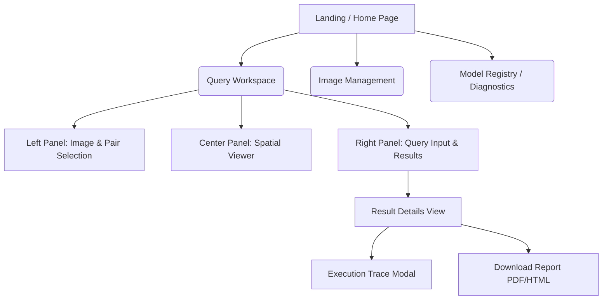
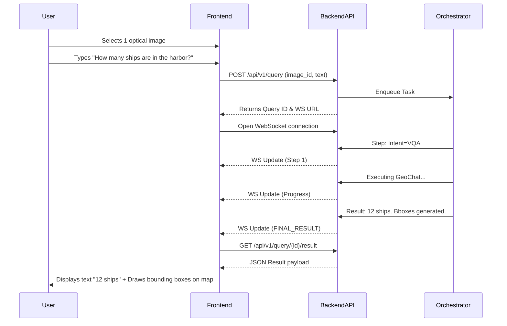
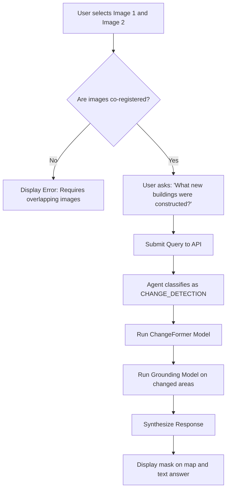

# UI/UX Design Document

## 1. DOCUMENT CONTROL

**System Name:** SatQuery AI  
**Problem Statement:** PS ID 26167 — SatQuery AI - An Interactive Vision-Language Assistant for Multimodal Remote Sensing Image Analysis through Text Queries  
**Organization:** Indian Space Research Organisation (ISRO), Department of Space  
**Document Status:** Final Draft  
**Target Audience:** Frontend Developers, UI/UX Designers, Product Managers  

---

## 2. DESIGN PHILOSOPHY

SatQuery AI interfaces must bridge the gap between complex geospatial machine learning and actionable operational intelligence. 

### 2.1 Target Users
1. **ISRO Scientists / Remote Sensing Experts:** Need advanced tools for validation, raw data inspection, and detailed pipeline traces.
2. **Disaster Responders / Government Officials:** Need rapid, conclusive answers to queries (e.g., "Show me flooded areas") without configuring model hyperparameters.
3. **Non-GIS Domain Experts (e.g., Urban Planners, Agriculturists):** Require intuitive interaction via natural language rather than complex spatial querying languages like PostGIS.

### 2.2 Core Design Principles
- **Simplicity via Natural Language:** The interface should feel as conversational and intuitive as consumer-facing LLMs, abstracting away the geospatial processing complexity.
- **Evidence-Grounded Answers:** Responses must never be just text. Every claim must be tied to a visual, spatial overlay on the image.
- **Transparent AI:** The execution trace must be observable. Users need to understand *which* models were used and the *confidence* of the inference to trust the system in high-stakes scenarios.
- **Graceful Degradation:** If an input lacks certain metadata or bands, the UI must clearly guide the user on what functionality remains available (e.g., single-image VQA fallback).

---

## 3. INFORMATION ARCHITECTURE

### 3.1 Site Map

### 3.2 Navigation Structure
A consistent top-level navigation bar is present across all authenticated views.
- **Logo:** SatQuery AI (ISRO branding on the left)
- **Links:** Workspace, Imagery Library, Model Diagnostics, Help/Docs
- **User Actions (Right):** Profile Settings, Theme Toggle (Light/Dark), Logout

---

## 4. PAGE DESIGNS

### 4.1 Landing / Home Page
The initial entry point providing system context and quick-start actions.
- **Hero Section:** A prominent search bar centered on the screen inviting the user to "Ask anything about your Earth Observation data..." with a subtle, animated background showing a transition from raw optical imagery to analyzed segmented maps.
- **Feature Highlights:** Three cards explaining the capabilities: Single-Image Analysis, Bi-Temporal Change Detection, and Optical-SAR Fusion.
- **Quick-Start:** A drag-and-drop zone to immediately upload a GeoTIFF and jump into the Workspace.

### 4.2 Query Workspace (Main Application Page)
This is the core operational page. Designed with a flexible three-panel layout to maximize screen real estate for high-resolution imagery.

#### 4.2.1 Left Panel (Data Context)
- **Image Inventory:** A collapsible list of recently uploaded images and their thumbnails.
- **Pair Configuration:** A drag-and-drop mechanism to assign "Image A" and "Image B" for change detection tasks. Shows a green checkmark if the backend confirms they are co-registered.
- **Metadata Summary:** Shows CRS, bounding box, resolution, and acquisition dates for the active images.

#### 4.2.2 Center Panel (Spatial Viewer)
- **Map Container:** Utilizes Leaflet integrated with React.
- **Viewing Modes:**
  - *Single Image View:* Displays the base RGB rendering or SAR amplitude.
  - *Split-Screen Slider:* For bi-temporal pairs, a draggable vertical slider allowing the user to wipe between Image A and Image B.
- **Geospatial Controls:** Zoom, pan, full-screen toggle, measurement tools (distance/area).
- **Overlay Toggle:** A layer manager to turn on/off the outputs of the ML models (e.g., bounding boxes, segmentation masks, change heatmaps).

#### 4.2.3 Right Panel (Query & Results)
- **Query Input Area:** A persistent text box at the bottom.
- **Suggested Queries:** Dynamic pills above the input box (e.g., "Find buildings", "Assess flood damage", "Calculate NDVI") that adapt based on the selected imagery.
- **History/Chat View:** The main body of the panel acts as a chat interface, showing a chronological list of user queries and the corresponding system responses.

### 4.3 Results Panel (Detailed View)
When a query completes, the response is appended to the right panel.
- **Textual Answer:** Direct, concise natural language response.
- **Confidence Badge:** A visual indicator (e.g., Green for >85%, Yellow for 60-85%, Red for <60%) indicating the model's certainty.
- **Action Buttons:** "Show on Map" (toggles layers in the center panel), "View Trace", "Export".
- **Execution Trace (Expandable):** A stepped timeline detailing the agent's workflow:
  1. *Intent classified as CHANGE_DETECTION.*
  2. *Validating co-registration... Success.*
  3. *Running ChangeFormer on Bi-temporal pair.*
  4. *Synthesizing text response from mask outputs.*

### 4.4 Report View
A dedicated layout optimized for printing and PDF export.
- **Header:** ISRO logo, Report ID, Date, User Name.
- **Summary:** The original query and the final executive summary.
- **Evidence:** High-resolution snapshots of the map viewer with the relevant overlays active.
- **Methodology:** The full execution trace appended for auditability.

### 4.5 Image Management Page
A tabular view for organizing the organization's data assets.
- **Data Table:** Columns for Filename, Sensor Type, Date Acquired, Size, Processing Status.
- **Actions:** View Metadata, Validate Pair, Delete.
- **Bulk Upload:** A modal for uploading batches of images or ZIP archives.

---

## 5. USER FLOWS

### 5.1 Single Image VQA Flow

### 5.2 Bi-Temporal Change Query Flow

### 5.3 Cross-Modal Analysis Flow
Similar to the single image flow, but the user selects an Optical and a SAR image of the same extent. The UI updates to show the "Optical-SAR Fusion" badge, indicating that downstream queries will utilize the specialized dual-encoder fusion module.

---

## 6. COMPONENT LIBRARY

All UI components are built using React, Tailwind CSS, and Shadcn/UI for a clean, consistent, and accessible aesthetic.

### 6.1 ImageUploader
A robust drag-and-drop zone. Features include:
- File type validation (.tif, .png, etc.).
- Progress bar for the multipart upload.
- Immediate client-side extraction of basic file info (size, name) before upload.

### 6.2 QueryInput
A text area that grows with content. Includes:
- An attachment icon (to reference specific images).
- A submit button (airplane icon) that shows a spinner while the query is processing.
- Keyboard shortcut support (Cmd/Ctrl + Enter to submit).

### 6.3 ConfidenceBadge
A small, colored pill component.
- High: `bg-green-100 text-green-800`
- Medium: `bg-yellow-100 text-yellow-800`
- Low: `bg-red-100 text-red-800`
- Tooltip on hover explaining the metric.

### 6.4 ExecutionTraceViewer
A vertical stepper component.
- Active steps pulse with a blue dot.
- Completed steps show a green check.
- Failed steps show a red X and expand to show the error stack trace or fallback logic.

### 6.5 SplitScreenSlider
A custom Leaflet control. Renders two image layers and a vertical draggable handle to mask the top layer, revealing the bottom layer. Essential for visual change verification.

### 6.6 MapOverlayToggle
A floating panel within the map container allowing users to adjust opacity and visibility of multiple GeoJSON / raster layers (e.g., Base map, SAR layer, ML Segmentation Mask).

---

## 7. RESPONSIVE DESIGN CONSIDERATIONS

While the primary use case is desktop-based due to the complexity of GIS data, the application must handle various screen sizes.
- **Desktop (1024px+):** The standard three-panel Workspace layout.
- **Tablet (768px - 1023px):** The left panel (Image Inventory) becomes a sliding drawer that can be toggled via a hamburger menu. The right panel (Query) takes up the bottom 30% of the screen.
- **Mobile (<768px):** The Workspace is simplified. The map takes up the full screen, with a floating action button to open the query interface as a modal overlay.

---

## 8. ACCESSIBILITY (WCAG 2.1 AA)

- **Keyboard Navigation:** All critical flows (upload, query submission, panel toggling) must be fully navigable via keyboard.
- **Screen Readers:** Appropriate ARIA labels on all map controls and dynamically updating query result regions.
- **Color Contrast:** The primary color palette has been checked against WCAG AA standards. Text on the map must have a readable backdrop (e.g., semi-transparent overlays for labels).
- **Reduced Motion:** Animations (like the pulse on the loading state) respect the `prefers-reduced-motion` OS setting.

---

## 9. DESIGN TOKENS

The theme is professional, modern, and aligned with ISRO's scientific focus.

### 9.1 Color Palette
- **Primary Blue:** `#0B3D91` (Used for primary buttons, active navigation states)
- **Secondary Blue:** `#1E5DB0` (Used for hover states, accents)
- **Accent Orange:** `#FF8C00` (Used sparingly for calls to action or highlighting crucial changes in imagery)
- **Background (Light Theme):** `#F8FAFC` (Slate 50)
- **Surface (Light Theme):** `#FFFFFF` (White)
- **Text (Primary):** `#0F172A` (Slate 900)
- **Text (Secondary):** `#475569` (Slate 600)
- **Success:** `#10B981` (Emerald 500)
- **Warning:** `#F59E0B` (Amber 500)
- **Error:** `#EF4444` (Red 500)

### 9.2 Typography
- **Primary Font:** *Inter* (sans-serif). Chosen for its high legibility in dense data applications.
- **Monospace Font:** *Fira Code* or *JetBrains Mono*. Used for displaying raw metadata, JSON payloads, or execution trace logs.
- **Scale:**
  - H1: 2.25rem (36px), Bold
  - H2: 1.875rem (30px), Semibold
  - H3: 1.5rem (24px), Medium
  - Body: 1rem (16px), Regular
  - Small: 0.875rem (14px), Regular

### 9.3 Spacing
Based on a standard 4px grid system (Tailwind defaults).
- Padding standard: `p-4` (16px) or `p-6` (24px) for cards and panels.
- Gap standard: `gap-4` (16px) for related components in a flex layout.

---
*End of Document*
